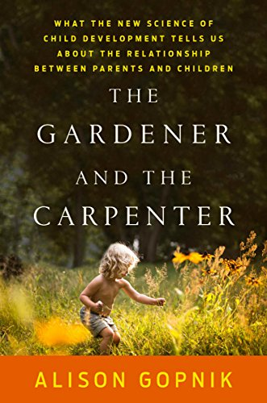
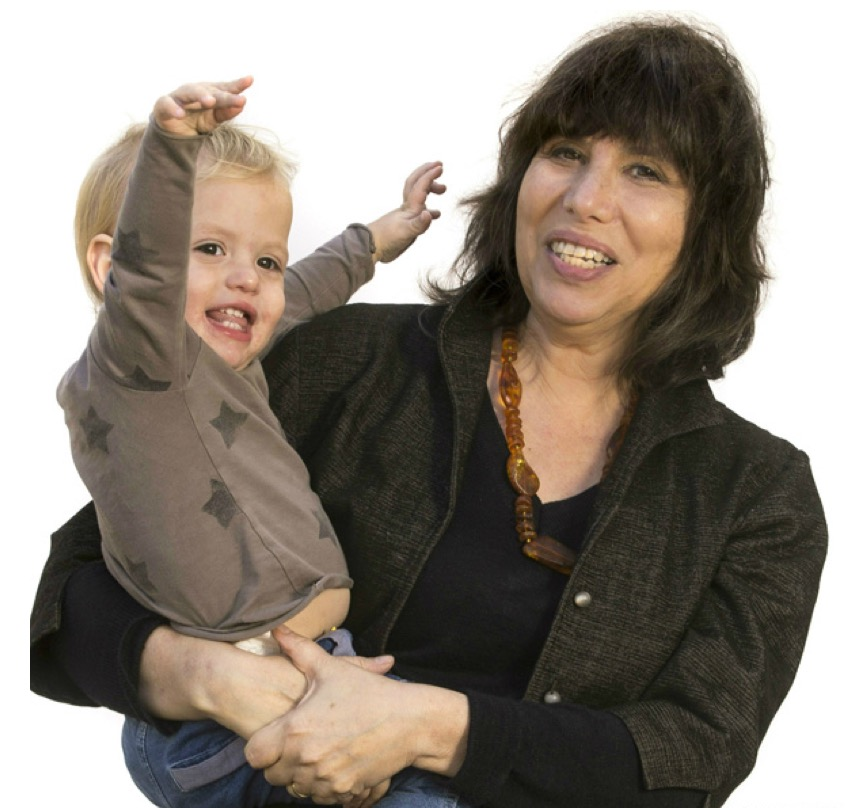

## 序言 高观点下的人生和育儿

《园丁与木匠》（The Gardener and the Carpenter: What the New Science of Child Development Tells Us About the Relationship Between Parents and Children）是一本有关怎么做家长的书，作者是是加州大学伯克利分校的发展心理学家艾莉森·高普尼克（Alison Gopnik）。就算你不是家长甚至根本不打算要孩子，我相信你也会对这本书感兴趣，因为它会让你深入理解“人”。

我有两个小孩，但我对“怎样当好家长”这个话题没有太大兴趣。一方面我觉得自己应该志在科学、政治和社会，研究育儿太小家子气。但另一方面，我认为所谓“育儿指南”，大部分都是不怎么靠谱的学问。

你问任何一个“育儿专家”，在这个具体事情上，我应该对孩子做什么 —— 他都能讲一大堆道理说明为什么你只应该这么做。他会说如果你不这么做，就会有什么什么样的坏影响，搞不好会毁了孩子的一生。

可是事实上，你看看那些真有出息的人物，他们的父母多种多样，有的有文化有的没文化，有的有钱有的没钱，有的管得严有的管得松……他们的共同特点是没读过什么育儿指南。

与此同时，我们还看到大量负面的育儿案例，什么高知父母管得孩子厌学，中产父母逼得孩子自杀，他们都是育儿指南的受害者。

当然这么说不科学，我们不能拿特例和个人观感下结论。如果是科学地说，据我所知，家长对孩子的影响的确是非常重大的 —— 但是这个影响并不体现在育儿指南上。家长影响孩子，有三个方面 ——

第一是提供遗传基因。这个相当重要。智力之类的素质是可以遗传的。我以前看过研究，说哪怕一个父亲生下孩子之后就死了、或者跑了，他从来没有照顾过孩子一天，这个孩子的智商和父亲的收入水平之间都有一个正相关。

第二是提供家庭环境。这个也非常重要。中国几乎所有家长都很重视子女教育，而美国的情况则是明显的阶级分化：中产阶级家长非常重视孩子，他们的孩子的学习成绩、包括将来的成就，都比贫困家庭的孩子好得多。

稳定温暖的家庭环境，问问题能得到家长的回答，想去博物馆能去，想学什么课程能学，潜移默化知道怎么跟大人、陌生人、有权威的人打交道，这些肯定能让孩子受益终身。但这些事情只要是有一定条件、有一定责任心的家庭都能做到，你还是不用看育儿指南。

第三，是具体的操作方法。这才是育儿指南大显身手的地方。而科学研究表明，具体的操作方法根本不重要。

你是个什么人，比你对孩子做什么，重要得多。

有的人长大以后抱怨父母钱少，有的人抱怨父母虐待，但是我从来没听说过有谁抱怨父母当年没送他上书法学习班。

话虽如此，作为父母总觉得肯定有些操作是应该做的，我们总不可能就放纵孩子野蛮生长吧？那到底应该对孩子做什么呢？这就是为什么要读《园丁与木匠》这本书。

这本《园丁与木匠》2016年就出版了，据我所知还没有中文版，但是网上有一些中文的书评你可以先看看 —— 不过我觉得有些书评的作者没看懂这本书。

高普尼克这本书，是从*高观点*来讲育儿。这根本就不是一本励志的育儿指南，它讲的是最新科学结果，是人生的哲学，和童年对整个人类的价值。

想要真正掌握“术”，你得先理解“道”。想要知道怎么对待孩子，你得先知道童年到底是干什么用的。想要帮助孩子学习，你得明白儿童学习的脑科学原理。

高普尼克对儿童发展心理学，特别是儿童怎么学习、怎么探索的研究很深，以前出过一本书叫《宝宝也是哲学家》（有中文版）。儿童学习方面的问题如果可以在当今任选一个人问，你就应该选她。

高普尼克已经六十多岁了，当年自己作为一个忙碌的科学家没有多少时间管孩子，可是她的三个儿子都非常有出息。她现在已经升级做了奶奶，他从孙子身上又反思了到底什么是育儿。

> 高普尼克和孙子，2016年

在育儿专家看来，育儿是一项可以按照说明书操作的工作。而在高普尼克看来，育儿是在一系列矛盾中寻找一个平衡点的艺术。

下一讲开始，咱们至少先理解这些矛盾。
