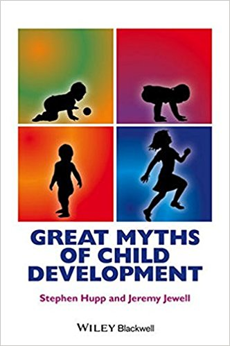

## 第八章 番外篇：十个育儿谬误 {docsify-ignore}

前七章我们在讲育儿的事儿，我们是站在科学的立场，提供高观点的观念和方法。正如高普尼克说的，各种育儿指南，各种什么“parenting”方法，都是不科学的。你是一个什么人，比你具体对孩子怎么操作，要重要得多。

今天来个番外，说几个有关育儿特别常见的错误认识。我们要借助一本2015年出版的书，叫《儿童成长的重大迷思》（Great Myths of Child Development），作者是南伊利诺伊大学的两个心理学家，Stephen Hupp 和 Jeremy Jewell。

所谓“迷思”，就是英文“myth”，经常被翻译成“神话”。用在像这种科学类的语境中，特指人们普遍相信，但是是错误的认知。有点像中文的“迷信”，但迷思里面一般没有什么超自然的东西，通常是那些自以为科学、但其实不对，的看法。

我以前读过一本书叫《50个流行心理学迷思》，写的很好。后来出版社干脆弄了一个系列，叫《心理学重大迷思》，这本《儿童成长的重大迷思》就是其中的一本。这套书的特点是特别讲究学术性，每一个观点背后都有大量参考文献，代表这是学界的共识。如果这套书说哪个流行观点错了，我们这个是对的，那你基本上就可以相信他们是对的。

在我看来这样的书应该在每个领域都出一套，生活中各种不靠谱的见识实在太多太多了。这套书，是常识的解药。

书中一共有50个迷思，我从中选了十个，给你说说。

### 1）加强的亲密联系有利于亲子关系

我们知道家长和孩子之间建立一个亲密的关系，对孩子成长非常有好处。但是亲密关系是不是就得时刻不分离呢？美国流行一个说法叫“attachment parenting”，说在孩子婴儿期的几个关键阶段，母子应该紧密联系在一起。

比如说，有人认为小孩刚出生的两个小时之内，必须偎依在母亲身边，让他一出生就感受到母爱的温暖，否则就可能影响以后的关系。

现在医生的确都是这么做的。但事实上，科学研究认为根本不存在什么两小时关键期这个说法。如果有什么特殊原因要在出生之后把孩子和母亲暂时分开，根本不影响以后的关系。

还有个说法认为母乳喂养有利于加强亲子关系，应该延长，最好一直延长到七岁再断奶！科学家的研究结果是母乳喂养只在第一年有好处，一岁断奶非常合适。

还有就是我们说过的要不要让孩子跟母亲一起睡。有很多育儿专家认为孩子跟母亲同床睡有利于感情养成，但是美国儿科学会认为同床有被大人压住导致窒息的危险，建议让孩子单独睡婴儿床。

不过我最近刚看到一篇文章 [1]，说同床压住婴儿这种事情通常是发生在大人过度肥胖、大人酗酒和大人智力水平很低的情况下，一般正常的夫妇，基本上无需担心。

所以，亲密关系，无需用这些方法“亲密”出来。

### 2）小孩哭着睡会伤害成长

刚有小孩的家长一个最大的困扰就是孩子晚上哭闹不睡怎么办。绝大多数家长的做法都是抱起来轻轻摇一摇，给哄睡了再放下。有时候一晚上要哄好多次，简直不胜其烦。

美国早在一百多年前就有人建议，说如果孩子没毛病，尿布都换好，床铺弄舒服，那就可以把他放在自己的床上，让他哭，哭着哭着自己就睡了。有些家长的确就是这么做的。但是也有很多育儿专家说这么做不行，小孩哭得太多，将来的情感成长会受到伤害。

这个问题争议巨大。调查表明61%的育儿指南认为应该放任孩子哭着睡，31%的育儿指南认为应该哄睡，剩下8%没有表态。而家长方面，则是59%选择了哄睡。

科学的答案是什么呢？几个大规模随机实验研究表明，哭着睡没问题。科学家的建议是只要孩子过了六个月大，就不应该哄睡了。让他自己哭一会儿，哪怕多哭一段时间，都不会影响健康，也不会影响将来的情感成长。事实上哭着睡有利于孩子学会控制感情，养成自然入睡的习惯。

哄睡反而可能不好。孩子失去独立性，而且如果过分依赖哄睡，一旦半夜醒过来还得哄。当然，如果孩子是疼痛、病了或者需要换尿布，那你必须立即反应。

我记得我儿子小时候有一次晚上不睡一直哭，我跟妻子当时没经验，竟然把他送到了急诊室！医生护士一通检查什么问题也没发现，说孩子哭很正常你们何必反应这么大，你就让他躺在床上哭就行。我就问医生要哭多长时间才必须采取行动？医生想了想，说……四个小时。

### 3）吃太多糖会让孩子过分活跃

糖是能被人体快速吸收的能量。很多家长和育儿专家相信吃糖会让孩子变得过分活跃、特别兴奋，他们可能会更爱打闹，不好好学习不睡觉。还有人认为经常吃糖的孩子容易得儿童多动症。

科学家为此做过大量的研究。比如一个方法是用安慰剂代替糖来做对比试验。有人调研了23项这种严格研究，结论是吃糖，跟活跃、跟儿童多动症之间没有联系。

糖，不是毒品，也不是兴奋剂。当然吃太多糖可能对牙不好……但是真的不会影响到精神层面。

### 4） “益智”节目有利于大脑发育

你是否听说过听莫扎特音乐能让孩子更聪明呢？莫扎特音乐 CD 现在属于育儿产业，类似的还有“小小爱因斯坦”DVD，都是让你给孩子播放，希望孩子在潜移默化之中，获得一点智力的加持。

科学的结果是这些东西对两岁以下幼儿没有任何帮助。是，孩子擅长模仿 — 但是请注意，孩子只模仿近在眼前的、活生生的人。电视里的人不算。我以前就看过很多研究，莫扎特 CD 不会提高智商，打着爱因斯坦旗号的 DVD 纯属浪费时间。

还有人认为看电视至少能让孩子学点语言啊？科学答案是这个用处也不存在。只有让一个真人跟他说话 — 哪怕是妈妈给他读一本书 —— 才能让幼儿学到语言。

我猜这对幼儿园老师是个好消息，这意味着他们的工作将不会被人工智能取代。美国儿科学会建议不要让两岁以下孩子看电视。那两岁以上呢？有研究表明两岁以上儿童看教育节目似乎有一些效果 —— 但是什么节目都远远比不上跟真人互动。

### 5）头脑体操有利于儿童学习

我们都知道运动有利于大脑，那幼儿应该怎么运动呢？有一种被商业推广的“头脑体操（Brain Gym）”项目，让孩子做一些特定的动作，比如说打哈欠、用手指画一个想象中的符号、在地上爬，说这能促进大脑发育……

科学家调研了相关的研究。五个研究都是商业赞助的。现在没有可靠证据表明做这种体操对孩子有什么好处。

### 6）独生子女容易被惯坏了，更自私

我小时候经常听说的一个说法叫“中国小皇帝”，现在已经几乎没人提了。但这似乎已经成了常识：独生子女集全家宠爱于一身，肯定是被惯坏了，肯定更自私，肯定更不善于跟人合作……

美国人民也是这么想的，但是人民想错了。把独生子女和家里有兄弟姐妹的孩子作对比的研究非常之多，有人综合分析了141项这样的研究，结论是两点 ——

1. 独生子女有优势：他们对成就的野心更大、自尊心更强、跟家长的关系更好；

2. 在成熟度、合作精神、自控力、感情稳定度、社交参与度、外向度和受欢迎程度方面，独生子女跟其他孩子没有任何区别。

这些研究大都是美国的数据，那中国独生子女有问题吗？也没有。科学家专门研究了中国独生子女，结论是，在性格方面，“不存在独生子女效应”。

可能人们猜测有独生子女效应是因为觉得独生子女没有伙伴 —— 但是别忘了，孩子在学校里能获得充分的同辈社交机会。

### 7）父母离婚会毁掉孩子一生

幸福的婚姻是相似的，不幸的婚姻中绝大多数是为了孩子而维持。育儿专家说离婚对孩子影响特别不好，甚至可能毁了孩子一生，这对不对呢？

请注意，美国一半的孩子都在十八岁以前经历过父母离婚的剧情。这些孩子没有被毁掉。

科学家综合分析了67项有关离婚对孩子影响的研究，结论是的确有影响，但是影响并不大。父母离婚对孩子的心理和行为的影响是比较小的，对孩子学习成绩的影响就更小了。而且考虑到贫困家庭更容易离婚，排除贫困因素，离婚对孩子学习成绩的影响就更加小。

更进一步，离婚家庭的孩子之所以有一定的心理问题，也许不是因为离婚动作本身，而是因为父母经常争吵。那假设父母已经经常争吵了，离婚好还是不离婚好呢？答案是这样的家庭离不离婚对孩子的影响非常小，但总体而言，离婚比不离好 —— 孩子宁可只跟一位家长生活，也不愿意整天看打仗。

离婚技巧也是一个问题。科学家相信，如果离婚之前好好跟孩子谈谈，孩子将会更容易面对。

### 8）打孩子

在说这个迷思之前咱们先说另一个迷思：美国人打孩子吗？咱们中国很多人认为美国家长打孩子是违法行为，美国人不打孩子。其实不是这样的。

法律规定是虐待孩子不行，而日常打孩子，只要孩子不受伤，是合法的。美国人民依法享有选举、言论自由、持枪和打孩子的权利。69%的美国人认为打孩子是合理的教育手段。90%的美国儿童家长曾经在过去一年内体罚过孩子，而且平均每个月一次。有一半家长甚至还打过婴儿。

那打孩子有效吗？得分长期和短期。

短期内制止孩子的一个错误行为，科学的研究表明，打，比单纯讲理有效。但是如果你是想让孩子吸取教训，从此一生中都不这么做，追求长期疗效，那么科学结论是打孩子没有好处。

而且如果打多了还有坏处，会伤害亲子关系，对孩子性格有危害。但是如果打的比较轻微或者中等，有没有坏处，现在研究还有争议。

### 9）性格跟出生顺序

文艺作品里通常是老大稳重勤勉，中间的孩子懒惰，最小的孩子外向而又积极……真实情况是出生顺序对性格的影响非常小。这里没有细说，但是科学家也承认有 —— 微弱的 —— 影响。

### 10）不应该给孩子物质奖励

如果你想鼓励孩子某一个行为，比如说倒垃圾、好好学习、整理房间，是否可以使用金钱或者别的什么物质奖励呢？如果大家都是理性人，经济学规律应该起作用，物质鼓励似乎是可行的。

这本书的说法，跟我以前了解的有出入。这本书认为物质鼓励可行。这个理由是初期孩子可能因为物质鼓励而这么做，但是他慢慢会养成习惯，然后你即使撤销这个鼓励，他还会继续这么做。

我以前听说这招对鼓励幼儿学习独立大小便很有效，但是对高中生倒垃圾无效 —— 因为高中生有思想，他认为靠倒垃圾挣父母的钱简直是耻辱。

所以这里姑且存疑，这个问题太复杂，应该具体情况具体分析。

***

通过这十个迷思的解读，你是否有一种感觉 —— 孩子是一种非常经得起折腾的东西。让他哭也好、吃糖也好、哪怕你离婚也好，你基本上折腾不坏他们。并不是我故意挑选了这样的迷思，书中其他四十个迷思破解也都能减少你的焦虑感。我理解这显然是进化的设定。现代人的生活比过去稳定多了，过去的孩子受那么多苦都没问题，又怎么可能被你用合法手段给毁了一生。

当然这些研究同时也告诉我们，你想把孩子给往好了折腾，也很难很难。所以基本上父母没有那么容易干预孩子的成长。

还是那句话：你是什么人，比你对孩子做什么，重要得多。做人难，但是做家长没那么难。不要整天战战兢兢动辄得咎的样子，这不是伴君如伴虎的事儿。
