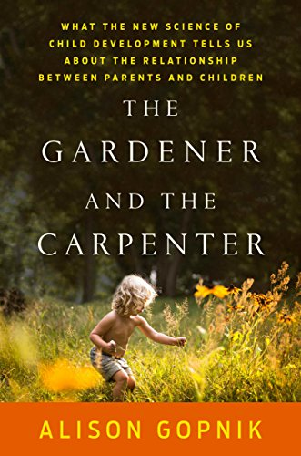
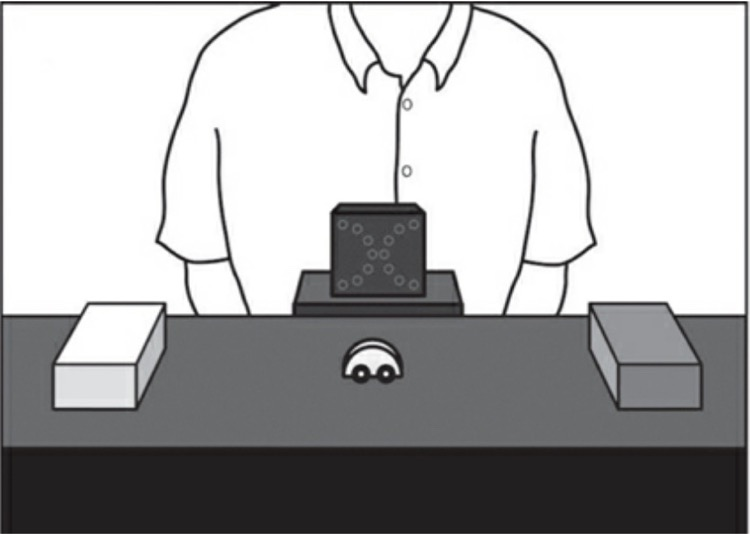
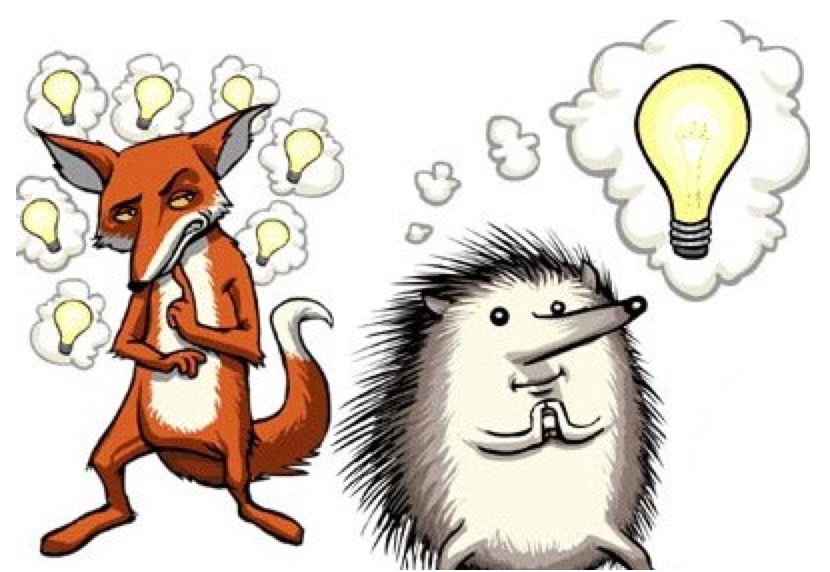
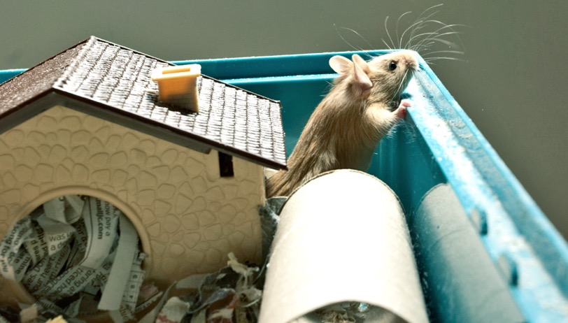
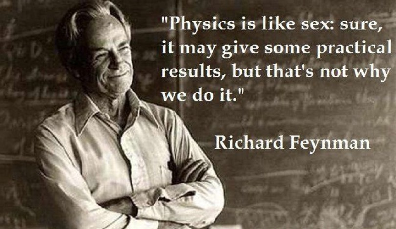
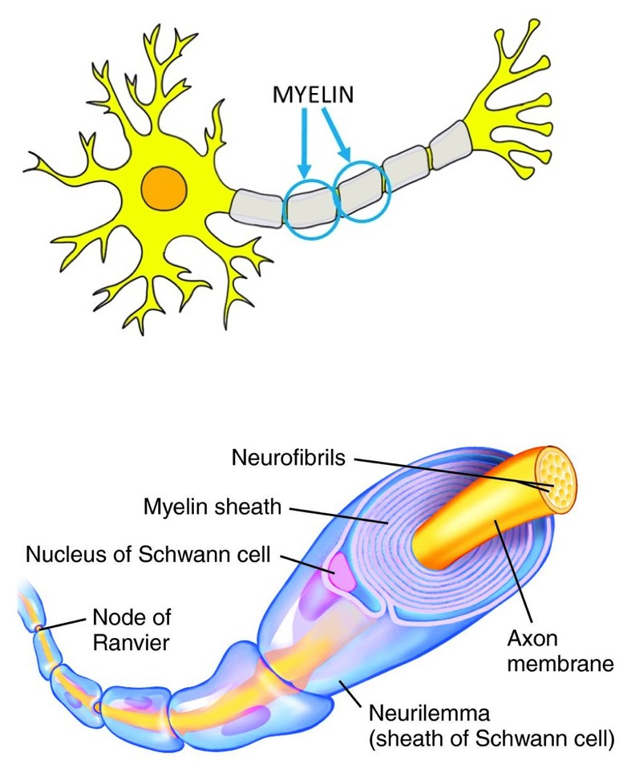

# 育儿和人生 {docsify-ignore}

[喵小哥](https://51world.win)（编著）&copy; 2020

### 写在前面

市面上关于育儿的课程和书籍汗牛充栋，偶尔还有专家学者大 V 相互“撕逼”，让人疑窦丛生，失去主见。

本书分为上篇《道》和下篇《术》。

关于道和术，简单可做如下表述：

>老子：有道无术，术尚可求也。有术无道，止于术。
>
>庄子：以道驭术，术必成。离道之术，术必衰。
>
>《孙子兵法》：道为术之灵，术为道之体；以道统术，以术得道。

道是世界观、走的道路，术是方法论、走的方式。道和术排列组合可以有不同的效果：
- 道为正，术为正，则事半功倍
- 道为正，术为负，则事倍功半
- 道为负，术为正，则事为劳心
- 道为负，术为负，则一事无成

理解了上篇的道，那么下篇中的术是否可行，或者对于理解育儿专家为何意见不一致的现象，你就能有自己的判断了。

本书内容参考于以下列表：
> - <small>得到平台万维钢《精英日课》专栏</small>
> - <small>《樊登读书》育儿相关书目讲解</small>
> - <small>魏坤琳的《给孩子的未来脑计划》</small>
> - <small>尹建莉的《好妈妈胜过好老师》</small>

如造成侵权行为，直接右下角联系作者，火速回复。

-----

# 序言 上帝视角下的育儿和人生

《园丁与木匠》（The Gardener and the Carpenter: What the New Science of Child Development Tells Us About the Relationship Between Parents and Children）是一本有关怎么做家长的书，作者是是加州大学伯克利分校的发展心理学家艾莉森·高普尼克（Alison Gopnik）。就算你不是家长甚至根本不打算要孩子，我相信你也会对这本书感兴趣，因为它会让你深入理解“人”。

我有两个小孩，但我对“怎样当好家长”这个话题没有太大兴趣。一方面我觉得自己应该志在科学、政治和社会，研究育儿太小家子气。但另一方面，我认为所谓“育儿指南”，大部分都是不怎么靠谱的学问。

你问任何一个“育儿专家”，在这个具体事情上，我应该对孩子做什么 —— 他都能讲一大堆道理说明为什么你只应该这么做。他会说如果你不这么做，就会有什么什么样的坏影响，搞不好会毁了孩子的一生。

可是事实上，你看看那些真有出息的人物，他们的父母多种多样，有的有文化有的没文化，有的有钱有的没钱，有的管得严有的管得松……他们的共同特点是没读过什么育儿指南。

与此同时，我们还看到大量负面的育儿案例，什么高知父母管得孩子厌学，中产父母逼得孩子自杀，他们都是育儿指南的受害者。

当然这么说不科学，我们不能拿特例和个人观感下结论。如果是科学地说，据我所知，家长对孩子的影响的确是非常重大的 —— 但是这个影响并不体现在育儿指南上。家长影响孩子，有三个方面 ——

第一是 **提供遗传基因**。这个相当重要。智力之类的素质是可以遗传的。我以前看过研究，说哪怕一个父亲生下孩子之后就死了、或者跑了，他从来没有照顾过孩子一天，这个孩子的智商和父亲的收入水平之间都有一个正相关。

第二是 **提供家庭环境**。这个也非常重要。中国几乎所有家长都很重视子女教育，而美国的情况则是明显的阶级分化：中产阶级家长非常重视孩子，他们的孩子的学习成绩、包括将来的成就，都比贫困家庭的孩子好得多。

稳定温暖的家庭环境，问问题能得到家长的回答，想去博物馆能去，想学什么课程能学，潜移默化知道怎么跟大人、陌生人、有权威的人打交道，这些肯定能让孩子受益终身。但这些事情只要是有一定条件、有一定责任心的家庭都能做到，你还是不用看育儿指南。

第三是 **具体的操作方法**。这才是育儿指南大显身手的地方。而科学研究表明，具体的操作方法根本不重要。

你是个什么人，比你对孩子做什么，重要得多。

有的人长大以后抱怨父母钱少，有的人抱怨父母虐待，但是我从来没听说过有谁抱怨父母当年没送他上书法学习班。

话虽如此，作为父母总觉得肯定有些操作是应该做的，我们总不可能就放纵孩子野蛮生长吧？那到底应该对孩子做什么呢？这就是为什么要读《园丁与木匠》这本书。

这本《园丁与木匠》2016年就出版了，据我所知还没有中文版，但是网上有一些中文的书评你可以先看看 —— 不过我觉得有些书评的作者没看懂这本书。

高普尼克这本书，是从*高观点*来讲育儿。这根本就不是一本励志的育儿指南，它讲的是最新科学结果，是人生的哲学，和童年对整个人类的价值。

想要真正掌握“术”，你得先理解“道”。想要知道怎么对待孩子，你得先知道童年到底是干什么用的。想要帮助孩子学习，你得明白儿童学习的脑科学原理。

高普尼克对儿童发展心理学，特别是儿童怎么学习、怎么探索的研究很深，以前出过一本书叫《宝宝也是哲学家》（有中文版）。儿童学习方面的问题如果可以在当今任选一个人问，你就应该选她。

高普尼克已经六十多岁了，当年自己作为一个忙碌的科学家没有多少时间管孩子，可是她的三个儿子都非常有出息。她现在已经升级做了奶奶，他从孙子身上又反思了到底什么是育儿。

> 高普尼克和孙子，2016年

在育儿专家看来，育儿是一项可以按照说明书操作的工作。而在高普尼克看来，育儿是在一系列矛盾中寻找一个平衡点的艺术。

下一章开始之前，我们至少先需要理解这些矛盾。

-----

# 第一章 童年是一种风险解决方案

今天开始我们来讲一本有关怎么当家长的书，叫《园丁与木匠》（The Gardener and the Carpenter: What the New Science of Child Development Tells Us About the Relationship Between Parents and Children），作者是加州大学伯克利分校的发展心理学家艾莉森·高普尼克（Alison Gopnik）。

我们不是要讲什么育儿指南。高普尼克这本书带给我们的是一种高级的知识和观念。我们要理解到底什么是“童年”，儿童到底是怎么学习的，这样才能得到成长的心法。

你对孩子做什么操作，并不重要。重要的是你是个什么人，你跟孩子是个什么样的关系。

今天咱们先说“童年”。童年时代，小孩到底应该干什么呢？

## 1）“家长”不是动词

几十年前世界各地都是每家好几个孩子，能吃饱穿暖快乐长大就不错了，做家长没有什么育儿的焦虑感。中国家长大概是从八十年代开始对孩子精雕细刻，美国中产阶级则更早一点。

Parent（家长）这个词，在美国从七十年代开始，普遍具有了动词的形式，可以写成 parenting —— 意思是作为家长对孩子的操作。

你的 parenting 技能怎么样呢？育儿已经成了一门学问，有很多老一辈闻所未闻的讲究。

比如说，小孩晚上睡觉，是应该跟家长在同一个房间甚至在同一张床上睡 —— 育儿术语叫 co-sleeping —— 还是自己单独睡一个房间？

有些育儿专家会告诉你，一定要让孩子自己独立睡。很多美国家庭是孩子一出生就自己一个房间。但现在也有些育儿专家说这样会影响孩子的性格，还是应该一起睡，给孩子更多关爱。两派专家都能说出一套一套的理论，简直是你只要做错了就等于是对孩子的犯罪。

我感觉像高普尼克这样的科学家看育儿专家，就好像现代医学看民间偏方一样。事实是孩子小时候跟不跟家长睡，对他长大以后的性格、能取得什么成就，根本就没有影响。

你要是整天被这种细节困扰，就算工作不干了个人生活放弃，全力以赴钻研和实践 parenting，也未必能培养出什么好孩子。

高普尼克说 parenting 在科学上几乎没用，不但没用而且还有害。越来越流行的育儿指南不但没有改善孩子的人生，而且毁了家长的人生，而且毁了孩子的童年。

根本问题在于，孩子，并不是你 parenting 的产品。本来这个道理很简单 —— 如果你是一个妻子，你的丈夫不是你的产品，你丈夫婚后的收入水平、性格和快乐程度不是判断你是不是好妻子的标准。如果你是一个孩子，你父母的幸福度也不是判断你是不是好孩子的标准。

家长跟孩子，是一种关系，而不是一个操作。

做家长不是做木匠去生产产品，而是做园丁，是提供良好的环境，让产品 —— 啊不是，是让孩子 —— 自己好好成长。

那这个关系应该怎么处呢？首先你得知道童年到底是干什么用的。

## 2）越来越长的童年

以前说“穷人的孩子早当家”是一种美德，而现在的人三十岁了还整天“我们男孩子你们女孩子”，这是不是人的退化呢？

不是，这是人的进步。动物界的普遍规律是未成年期越漫长的物种，智力水平越发达。

哺乳动物的未成年期比一般动物长，灵长类动物的未成年期比一般哺乳动物长，而人类的未成年期则是最长的。大猩猩三四个月会走路，八九岁性成熟，十岁就已经生第一个孩子了，而今天的大多数人在这个年纪连饭都不会做。不但是身体，人类大脑也需要很多年才能长成。

以前有个解释说人类之所以儿童期长，是因为人类小孩的头太大，而直立行走以来女性的生理特征又不允许生头特别大的孩子，孩子必须还没长好就得生下来，都是早产儿。但这个说法只能解释人的*婴儿期*长，可是人类不仅仅是婴儿期长，童年和青春期都非常长，而且现在是越来越长，这又是怎么回事呢？

答案是因为人需要学习的东西太多了。有些八零后二十五六岁了还在上学，他们的父辈十八岁就已经参加工作了 —— 但是请注意，这一代人的知识水平和生活质量都比他们的父辈要强得多。

鸟类学家早就观察到，早熟的鸟，比如鸡鸭鹅，生下来没多久就能独立生存了，但是智力水平不行，也就会觅食，复杂的事儿干不了。而像乌鸦和鹦鹉非常晚熟，有一种乌鸦甚至需要被父母照顾两年，但是智力水平也高得多，那种乌鸦会使用甚至会*发明*工具。

不用为生计发愁，每天吃饱了除了学习就是玩，这是未成年人的特权。人类小孩还有一个特点，特别擅长被多个人关爱 —— 不仅父母喜欢他，爷爷奶奶、连周围陌生人都喜欢他，他能从很多人身上学到东西。

而人类中的成年人对此则是欣然接受，心甘情愿地给孩子提供各种服务保障。人类每一胎基本上就生一个孩子，都是精心养育，而且一养就是好多年，简直是做父母的把大部分精力都奉献给孩子了。现在有个理论说为什么别的哺乳动物都是过了生育年龄就死了，人类的女性却能在更年期之后还生活很多年呢？因为她要帮着照顾第三代。

当然这么做的回报也是巨大的，人类一代比一代强，早就不是一般的灵长类了。

之所以不一般，在于人，特别善于应对各种不确定性。

## 3）风险策略

人类这么长的未成年期并不是几十万年前就有，有个理论认为未成年期显著变长是源自地球在五万年前经历的气候变化。气候变化导致当时的人不得不到处迁徙，这又导致了面对环境的变化。从那时候起，人的生活主题就是变化。

怎么适应变化呢？更长的童年，就是人的风险解决方案。

如果环境永远不变，你只要会一种谋生技能就行了，就好像小鸡会吃地上的虫就行。如果环境复杂多变，你就最好多掌握几项技能、甚至最好还能自己发明新技能才行，你最好……变复杂。

学习一项技能需要专注，而变复杂需要在各个方向探索。可是如果你整天探索这个探索那个，不老老实实赶紧学个实用的，你靠什么生活呢？

答案就是靠父母。

我们专栏以前讲过《指导生活的算法》这本书，其中提到一个根本矛盾，就是探索和收获（explore/exploit）之间的矛盾。解决这个矛盾的策略就是小时候要多探索，长大以后再专注于收获。

所以父母的任务就是提供一个环境让孩子探索。他们可以无责任地随便折腾，变复杂，以期适应未来多变的环境。

那如此说来，“早当家”就不是好事儿，孩子不能当鸡鸭鹅养，养育的重点不是掌握某一方面的技能，而是让他学会面对未来的不确定性。

特别是幼儿，会多少个汉字，能不能算二十以内加减法，根本不重要。

## 4）混乱的价值

前几讲咱们先讲六岁以下的学龄前儿童的家教，之后再讲上学以后怎么办。六岁以下的儿童，他们的特点是混乱。

家里有一个小孩就已经很乱了，像我家有两个孩子，孩子的小朋友有时候还来玩，简直就跟战场一样。但是高普尼克说，童年真正的价值就在于混乱。

混乱是一种演化策略，有利于孩子发展各种个性，以备将来适应各种环境。有的孩子性格比较稳重，能专注做一件事，适合稳定的环境。可是如果环境复杂多变，孩子最好就要有爱冒险的精神，能机警地意识到周围的变化。

那难道说有什么环境就生产什么性格的孩子吗？不是。人类的策略是各种孩子始终都有、各种性格都保留，让他们自己去闯荡不同的环境。

由此来说，因为未来环境不可预测，孩子将来幸福不幸福、成功不成功就不是你所能决定的 —— 得看他的特性跟他将来遇到的环境是否匹配。我们专栏第一季讲过“兰花和蒲公英”的概念，有的孩子像兰花特别挑环境，有的孩子像蒲公英走哪都能活。你决定不了你的孩子是什么，通常一家几个孩子都各有各的特点。

孩子的运气是孩子自己的事情，家长所能做的就是提供多方探索、体验不同环境的条件。我们爱孩子是无条件的，不论他是蒲公英还是兰花，安静还是外向，爱冒险还是胆小，我们都尽量提供探索资源。

| 由此得到

家长对孩子是一种关系，而不是一种工作。漫长的未成年期是人类的竞争优势，人类面对复杂多变的环境采取了先探索后收获的策略。童年时代的主要作用是探索和学习。童年，是一种风险解决方案。

所以我们面对的第一个矛盾是探索和收获，对应到亲子关系上，就是依赖和独立。处理这个矛盾，家长要做的是提供资源保障，让孩子充分探索。

家长不能确保孩子将来一定成功，不能确保孩子一定聪明，也不能确保孩子一定幸福。家长要做的不是给孩子定制、制定或者指定发展路线。家长能做的，是让孩子面对这个充满不确定性的世界，具备抗打击能力、自我发展能力和创新能力。

这里所谓的探索，除了学习还有创新。所谓的提供资源保障，除了物质的还有更重要的是亲子关系上的。而事实上亲子关系对孩子学习有重大影响，咱们下一讲再说。

## 【划重点】

家长对孩子是一种关系，而不是一种工作。漫长的未成年期是人类的竞争优势，人类面对复杂多变的环境采取了先探索后收获的策略。童年时代的主要作用是探索和学习。 童年，是一种风险解决方案。

-----

# 第二章 真关系和假教育

今天咱们继续说艾莉森·高普尼克的《园丁与木匠》。我们来讲讲六岁以前的幼儿是如何学习的，高普尼克本人在这个领域亲身参与了很多研究。理解了今天的理论，你整个幼教观会有一个本质的改变。

以我之见，中式育儿的一个错误，是用训练大孩子的方法教小孩子。可能在某些家长心目中，所谓幼教就是让孩子在五岁的时候掌握教学大纲中七岁应该掌握的技能。

比如我最不能理解的一个活动就是背唐诗。一方面是连“鸿鹄之志”这种初中文化都没有的人能当北大校长，一方面是全民让刚会说话的两岁小孩背唐诗，这不荒唐吗？

两岁小孩理解不了为什么有话不好好说，非得说“欲穷千里目更上一层楼”。其实很多家长也不懂唐诗，他们也不打算让孩子理解 —— 他们只是想让孩子*会背*而已。他们选择了这个项目，也许是因为背唐诗有表演的性质，也许因为他们实在不知道还有别的幼教选项。

六岁以下的幼儿到底应该学什么呢？为什么你让他学的他不学呢？为什么他不听你的话呢？

孩子最想知道的是这个世界上的东西都是怎么工作的，这个世界上的人都是怎么回事儿。而他们的学习效率，取决于你和孩子的关系好不好。

不要问孩子为什么不听你的话，要问你配不配让孩子听话。

## 1）三个学习渠道

高普尼克说，学习有三个渠道。

第一个渠道是 **自己摸索和试错**。所有动物都会这种学习方法。这个东西能不能吃，那个东西怎么用，都是小动物一出生就在大自然中摸索出来的技能。一次做错了吸取教训再来一次，所有的亏都不会白吃。

第二个渠道是 **模仿**。看看别人怎么做的，自己模仿一下，这个只有高等动物 —— 包括大猩猩和某些聪明的乌鸦 —— 才会。人类儿童非常善于模仿，咱们下面再说。

第三个渠道是 **听讲**，这个只有人类会。

我们今天重点说模仿和听讲。你一定要注意，儿童既不是录像机也不是录音机，他们非常积极主动。

## 2）不是什么都模仿

人类孩子善于模仿，连刚出生的婴儿都会模仿大人的表情。而且孩子的模仿非常高级。他不是什么动作都模仿，只有你这个动作能够达到一定的目的，他才会模仿你。通过模仿，孩子能了解事物之间的因果关系。

有个实验是这样的。一个平台的中间有个玩具小汽车，两端分别有个障碍物。小汽车如果撞在左边的障碍物上，小汽车就会发光；撞右边的就没反应。实验人员就当着孩子的面操作这个小汽车，有时候往左边撞有时候往右边撞。

结果哪怕是两岁的小孩，当你把小汽车交给他的时候，他都会专门撞左边那个障碍物，好让车灯亮。他不是模仿你所有的动作，他只模仿你成功的动作。

还有个实验。实验人员把自己的手绑起来，走到一个电灯开关前面，用头去撞那个开关，把灯点亮。一个18个月大的孩子看到这种情况，他也想去开灯，但他不会用头撞，而是用手。孩子知道那个实验者之所以用头，是因为他的手不能动！

而在另一个场景中，实验者的手是自由的，但是故意不用手，用头把开关给撞开。结果这时候孩子的模仿就不用手了，也是用头！这是因为孩子一看你有手不用，他能分析出来，也许用头有什么特别的意义。

所以人类儿童的模仿是把动物界的模仿行为给提升到了一个全新的高度。他能够识别一件事儿的目的性，能做复杂的推理，知道哪些是多余动作，甚至还有仪式感，知道哪些多余动作有意义。

但是这里面有个关键。孩子模仿的对象，必须得是人。

还是前面那个撞小汽车的实验，如果没有实验人员，而是弄成一个小汽车自动运行的短片，那孩子就不会模仿。哪怕你是让一个机器人去做，孩子也不会模仿。孩子只模仿真正的人。

而且最好是关系亲近、跟他相似的人。两个实验人员在一个美国小孩面前做动作，一个说英语一个说法语，孩子会模仿说英语的那个人的动作。

所以你跟孩子关系越好，他越愿意模仿你 —— 但是你刻意的动作还未必有效果。孩子随时都在观察你，他不只是模仿你想让他模仿的事情。

你是孩子的榜样。

## 3）为什么你的孩子不听你的话

现代人教育小孩最常用的办法还是对话。对话，也是少数几个能真正影响孩子一生的、家长的干预方法。你可能已经知道，美国中产阶级的家长因为跟孩子说话多，孩子词汇量会比贫困家庭的孩子多很多，而这是一个重要差别。孩子为什么总爱问问题？以前有的育儿专家说可能他是想吸引你的注意力 —— 而科学家的说法是小孩问问题是因为他想对这个世界有更深更广的了解。

我们希望能传达给孩子一些知识，但是孩子非常挑人 —— 不是什么人跟他说什么东西他都信。

心理学家很早以来就把小孩跟大人的关系分成三类。我们以前在讲普林斯汀的《欢迎度》那本书的时候说过这种分类。要想知道你是属于哪一类，最简单的办法是做个幼儿园接送测试。

假设你是一个妈妈，早上把孩子送到幼儿园，下班再接回来 ——

**“安全型”** 的孩子，你送他到幼儿园、离开他的时候，他会对你依依不舍。他不想让你走，但是你走了也就走了。你去接他的时候，他看到你来会非常高兴。

**“回避型”** 的孩子，你走他无所谓，你来了他也没表现出有多高兴。

但是有心理学家后来做过测试，发现回避型孩子每次离开家长和见到家长的时候，心跳都在剧烈加速！孩子实际上有强烈感情变化，但是因为他跟家长关系很疏远，他克制了自己的感情。

**“焦虑型”** 的孩子，离开妈妈的时候简直是难舍难分、强烈哭闹，然后见到妈妈也哭闹，根本没法哄，就好像极度地需要爱一样。

有统计表明这三种孩子长大以后的感情生活也受影响。想想如果恋爱对象也有这三种类型，是什么样的剧情。当然统计归统计，也有很多人长大以后战胜了自己的性格缺陷。

而孩子是哪种类型，取决于家长。事实上有的孩子可以跟这个人是一种类型，跟那个人是另一种类型。

对于这三种孩子，家长想要通过对话来教孩子一些东西的时候，他们的接受程度非常不一样。

比如咱们拿四岁小孩做个实验。实验中拿一个孩子从来没见过的东西给他看，比如说是一张软盘。妈妈跟孩子说，这东西叫“存储器”，而一个陌生人说，这东西叫“软盘”。你猜孩子会听谁的？

安全型的孩子听妈妈的。他跟妈妈关系好，他相信妈妈的话。

但在另外一个测试中，有个玩具，既像是一只鸟，又像是一条鱼，总体更像是一只鸟。那你说这个东西到底是鸟还是鱼呢？妈妈说这是鱼，陌生人说这是鸟 —— 安全型孩子在这个情况下，会选择听陌生人的。

他爱妈妈，但是他更爱真理。他能看出来这个东西更像鸟，他不会盲目听妈妈的话。安全型孩子的学习模式非常健康。

回避型孩子会怎么做呢？面对第一个问题，他有同样大的可能性听妈妈的或者听陌生人的。妈妈在他心目中并没有更大的权威。那可想而知，面对第二个问题他就更不相信妈妈了。

焦虑型孩子在两个实验里都相信妈妈。妈妈说啥都是对的，他不顾客观事实……我担心他搞不好长大了会变成妈宝男。

所以当你指责孩子不听话的时候，先要问问自己跟孩子是个什么类型的关系。所谓“听话”，对孩子来说是一个非常主观的行动。

实验表明两三岁的小孩就已经善于判断一个人靠不靠谱。如果一个人讲述知识的时候很自信，表现出很擅长做这件事，小孩就会倾向于听他的话。小孩对自信的敏感度比大人还强烈，如果这个人不自信，小孩根本不信他。

这就是为什么假模假样地向孩子灌输知识没用。孩子能分辨出来你的矫揉造作虚张声势。要让他相信你、听你的话，首先要问你跟他的关系好不好，其次要问你自己行不行。

| 由此得到

六岁以下的儿童在模仿和听讲方面具有极高的水平。他们的学习是主动的、智能的，而且随时都在潜移默化地进行。他们学习的效果跟模仿和听讲的对象非常有关系。

这就是为什么我们专栏一直说你是什么人，比你对孩子做什么更重要。

如果你本人很靠谱，知识丰富充满自信，跟孩子的关系很亲密，孩子对你有安全感，他就愿意模仿你，他就更信任你的话。如果你本人的一举一动都很有教养，心地善良做事稳重，你的孩子也会是这样。

反过来说，如果你自己根本不读书，却在孩子面前刻意表演一个什么知识，逼孩子死记硬背天书一样的东西，他就会认为你不靠谱，你给他带来的都是困惑。

没有多少干预手段真起作用，但是家长跟孩子的三种关系，的确是影响深远。

古人说“言传身教”，在要求别人之前都先反思自己。现代家长不问自己是个什么人，试图把孩子当产品一样定制，这哪里是教育之道呢？

## 【划重点】

1.你跟孩子关系越好，他越愿意模仿你 —— 但是你刻意的动作还未必有效果。孩子随时都在观察你，他不只是模仿你想让他模仿的事情。你是孩子的榜样。

2.假模假样地向孩子灌输知识没用。孩子能分辨出来你的矫揉造作虚张声势。首先要问你跟他的关系好不好，其次要问你自己行不行。

3.你是什么人，比你对孩子做什么更重要。

-----

# 第三章 当孩子玩的时候孩子在学什么

今天咱们继续讲高普尼克的《园丁与木匠》，今天的主题是“玩”。六岁以下儿童的主要任务不是学习而是玩。而我们中国家长对玩，情绪复杂。

有些家长认为玩是不必要的，是意志力薄弱的表现，甚至可能还是一种堕落，正所谓“驰骋畋猎令人心发狂”。有些家长把玩设计成是一种休息或者奖励，比如有个说法叫“学习要认真地学习，玩要尽情地玩”，把玩当做充电和调节情绪的方法。

这两种观点都是把孩子的玩和成年人旅游看电影打麻将唱卡拉OK那种玩给混淆了。孩子的玩，是必不可少的成长环节 —— 玩不但能促进学习，而且是最重要的学习方式。

可是话要这么说，似乎就有个矛盾。玩，肯定就没有什么目的，就不是“刻意”的，可是学习得刻意练习啊？如果说玩能让人变得更聪明，那让孩子直接刻意练习、去做一些数学题之类，直接锻炼大脑不是更好吗？孩子为什么非得玩呢？

关于玩的研究以前非常少，直到最近心理学家才算有了一定的认识。高普尼克本人和她的学生，就做了大量玩的实验。我非常喜欢高普尼克对玩的理解，可以说她已经有了一个相当说得过去的“统一理论”。

孩子的玩一共有三种：跟别的孩子玩、玩玩具、和假装。

## 1）跟别的孩子玩

这种玩法是人跟人玩，可以叫“打闹”。比如几个小孩在一起打闹、互相追逐嬉戏。

打闹有点像打仗，孩子们就好像在演练各种攻防技术一样。但跟真实打仗又很不一样，我们专栏以前讲《头脑里的大象》这本书的时候说过，打闹都是用特别夸张的动作，表示这是开玩笑不是真打。高普尼克还说，打闹都是双方轮流进行，我打你一下，你也打我一下，大家都有演练机会。

但打闹不是训练。打闹的好处在于学习社交互动。

不让孩子玩太残忍了，所以科学家都是拿老鼠做“剥夺玩的权利”实验。如果一只老鼠从来没和别的小老鼠玩过，它往往也会做各种技术动作 —— 但是一旦跟别的老鼠互动，它不知道做各种动作的时机是什么。它不知道什么时候该做什么。

这就好比说步伐都会，但是不会跳舞；字都认识，但是不会连成一句话说。

那么可想而知，如果一个小孩从小都没有跟别的孩子打闹过，他到了社交场合就会表现得很笨拙，他不知道怎么跟人互动。

打闹，是一种社交演练。

## 2）玩玩具

哲学家卡尔·波普尔有句话说，作为科学家，如果你看到有数据不符合你的理论，你应该对这样的数据特别感兴趣。我们专栏讲过“信息就是意外”的道理，所谓探索，就是要寻找各种意外。

孩子玩玩具，也是在探索意外。

有人观察，哪怕是11个月大的婴儿，都有这种探索精神。比如说看一个球打到墙上又弹回来，婴儿看多了就会觉得这没什么，关注度下降。但是如果他看见一个球居然能穿墙而过，他就会表现出强烈的兴趣。

所以孩子都喜欢新奇的玩具，但这还不是最重要的。最重要的是孩子的玩法。他们会用各种方法折腾玩具，这么摆弄一下那么摆弄一下。特别是如果玩具的行为跟孩子设想的不一样，他会特别感兴趣，完全符合波普尔说的科学家标准。

所以孩子哪里是在玩玩具，他们简直就是在做科学实验。当成年人都陷入确认偏误不能自拔，只关注符合自己认知的信息的时候，孩子们保留了科学探索的火种。高普尼克深有所感，专门写过一本书叫《宝宝也是哲学家》。

但玩玩具还有实用的好处。探索有利于孩子掌握多方面的技能。

哲学家以塞亚·伯林有一个著名的比方，叫“狐狸和刺猬”。刺猬只知道一件大事，狐狸知道很多事。我在《智识分子》这本书里用过这个典故。我说有些学者只知道一个大主意就好像刺猬一样，而真正能理解复杂世界的其实是狐狸。

类比到人生的选择，像有些运动员和表演艺术家从小苦练，把一生押注在一门手艺上，就是刺猬；而有的人灵活性特别强，就相当于狐狸。

如果你想把孩子培养成狐狸，就得让他多玩玩具。事实上真实的狐狸跟刺猬的区别就是这样。刺猬出生六周后就离开父母，而狐狸要跟父母在一起生活六个月，而且还是被父母共同照顾。特别是母狐狸，经常把猎物带回家让小狐狸玩。

## 3）对大脑的影响

那你说就算要培养狐狸，我多报几个兴趣班，效率不是更高吗？不行。玩跟上课最大的区别在于它是一种主动的探索，是亲自面对真正的意外。吹拉弹唱才艺学习，这些都是按照老师要求做事，这不是玩。我们关心的不是学会了多少技能，而是将来能不能应对新的环境。玩，是让孩子摸爬滚打一身伤痕换一份体会。

跟其他孩子打闹和玩玩具这两项活动有一个最大的好处：促进大脑发育。脑神经科学家有个名词叫大脑的“可塑性”。大脑可塑性越高，你学习新东西就越容易。小孩的大脑可塑性非常高，但是很多人长大之后大脑就变得很不可塑了，就好像硬化了一样。

孩子玩的时候，大脑前额叶中负责社交的区域会释放出一种化学物质，这种物质能让大脑变得更可塑。

有个老鼠实验是这样的，第一类老鼠吃喝管够但是不给玩具。第二类老鼠的笼子里有各种玩具，什么斜坡、球、翻滚装置，可以自由玩耍。结果有玩具的老鼠在大脑的各个方面，比如脑容量、神经的连接数、前额叶皮层的面积，都远远超过了没有玩具的老鼠。

顺便说一句，烟草中的尼古丁也有类似的作用。为什么人们吸烟的时候会觉得大脑更好使，就是因为尼古丁能增加大脑的可塑性……玩，是没有副作用的尼古丁。

还有一种玩法，对智力成长没有这些好处，但是可能对人更重要。

## 4）假装出来的可能性

很多动物都会打闹和玩玩具，但是只有人类的孩子会假装。

最基本的假装就是角色扮演。我儿子特别喜欢假装孙悟空，对此我完全理解 —— 但我女儿就更有意思了，非得说她是猪八戒。

以前有学者认为小孩分不清虚构和真实。的确，据我观察美国大部分七岁以下儿童认为圣诞老人和牙仙女是真的 —— 但是现在的研究者确信，对一般想象出来的东西，孩子能分辨那是假的。特别是当孩子假装的时候，他们非常明白这是假的，但是他们乐此不疲。

假装有两个重要作用。

一个是想象不同的可能性。有个实验是这样的，先给孩子们玩一个带钥匙的音乐播放器。钥匙对了，它就能播放音乐，钥匙不对，它就播放不了。好，现在实验人员说，这个播放器必须得拿走了，这有个积木，我们能不能假装这个积木是播放器？

然后他们就拿假装的钥匙开启了这个假装的播放器。当然没有音乐播放出来，但是孩子们能够假装现在有音乐，并且跟着音乐唱歌。

好，下一步，老师说咱们换个钥匙，假装这个钥匙不好使 —— 于是孩子们又假装播放器无法播放音乐 —— 他们能够假装面对假装出来的沉默。

所以说孩子的假装能力非常高级。但是实验中有三分之一的小孩，没有这个假装能力。你跟他说咱们假装这东西正在播放音乐，他会说不对啊，它没有播放音乐啊。这一个实验，就把孩子分成了会假装和不会假装的两类。

然后你做个测试，让孩子们设想一个事物的各种不同可能性，结果就会发现，会假装的孩子能想象出很多可能性来，而不会假装的孩子没有这种能力。

而这是一种非常重要的高级能力。想象不存在的东西，这是创造力的起源 —— 按赫拉利的说法这可是智人的超能力！永远都是想法先行，敢想才能敢干。我们前面有一期叫《科学家的核心价值观》，科学发现就是这么来的。

高普尼克还专门做了实验，让孩子多玩假装，能激发他们想象不同可能性的能力。

但假装还有一个更重要的作用。

## 5）人生最值得学习的技能

假装的第二个作用，是让孩子学会理解别人的心理状态。而高普尼克认为，这个能力是包括大人在内所有人最值得学的技能。

这个能力在学术上叫做“心智理论（Theory of Mind）”，就是说你要知道别人的情绪是什么样，他有什么意图，他有什么欲望，他是真的还是假装，他的信仰是什么……你得会判断人的心理状态。

咱们举个例子。比如现在有个装创口贴的包装盒 ——

孩子们一看都认识。但是老师把盒子打开，一看里面装的不是创口贴，是曲别针。好，现在老师把盒子合上，问五岁的小孩两个问题 ——

第一，你知不知道这个盒子里装的是什么东西？

第二，你猜，别人会认为这个盒子里装的是什么东西？

正确答案是我知道盒子里装的是曲别针，我认为别人会以为盒子里边装的是创口贴。能答对这两道题，就说明孩子具备推测别人想法的能力。自闭症儿童没有这个能力，所以面临巨大的社交困难。而研究表明，越是平时爱玩假装游戏的孩子，越能通过这个测试。

我们一生都在琢磨别人怎么想，但心智理论学习的最关键窗口期是从18个月到五岁这段时间。

我们前面说了，六岁以下儿童最应该学的东西就是两个 —— 一个是世界上的东西都是怎么运行的，一个是人都是怎么回事儿。这第二个项目就是心智理论，是最重要的技能。说白了就是孩子得学会理解人，能善解人意就更好了 —— 而想要发展这种能力，最好的办法就是玩假装。

| 由此得到

孩子的玩法比大人高级，一共有三种 ——

1. 跟同伴打闹，这能让孩子学会社交互动；

2. 玩玩具，这能让孩子探索东西都是怎么工作的。

3. 假装，能够激发创造性，想象不同的可能性，而更重要的则是，掌握人生最重要的技能，也就是心智理论。

打闹和玩玩具都能增加大脑的可塑性，为将来学习其他知识做好准备。研究表明假装跟学习成绩没有必然联系，但是对心智成长至关重要。

所以玩既不是浪费时间也不是休息和奖励，玩就是最好的学习，玩是一种战略需求。六岁以下孩子最重要的任务不是认字和学加减法，而是充分地玩。

那家长能对孩子的玩做些什么呢？咱们下期再说。

## 【划重点】

孩子的玩法比大人高级，一共有三种：

1. 跟同伴打闹，这能让孩子学会社交互动；

2. 玩玩具，这能让孩子探索东西都是怎么工作的。

3. 假装，能够激发创造性，想象不同的可能性，而更重要的则是，掌握人生最重要的技能，也就是心智理论。

-----

# 第四章 因为孩子爱玩

今天咱们继续讲高普尼克的《园丁与木匠》，咱们接着说“玩”。

我儿子有几个小朋友经常到我家玩。我看他们玩的还挺复杂，有时候扮演忍者，有时候玩打仗，一人一把武器，有分工有合作有假装有剧情，上蹿下跳不亦乐乎。

这就使我想起以前看过的一本书，是我们经常提到的纽约时报的专栏作家戴维·布鲁克斯写的，叫《社会动物》（The Social Animal）。书中写到一个人，也是看他儿子和小朋友们玩觉得特别有意思，也是作为一个男人很羡慕，但是他做了我不敢做的事 —— 他提出要加入游戏！

一开始孩子们同意了他加入。结果他发现自己跟不上孩子们的思路。他也试图假装在战斗，可是孩子们都说他这里做的不对那里做的不对。他跟孩子在不同的思维频道，最后孩子们不带他玩了。

按照高普尼克的说法，很多大人都已经忘记怎么玩了。我们想想，大人的多数玩法其实是娱乐。什么看电影、唱卡拉OK或者喝酒聊天之类，就算偶尔去游乐场坐个过山车，也不符合我们上一讲说的孩子的三种玩法的特点 —— 打闹、探索新事物和假装。

那么作为大人，首先要做到别破坏孩子玩，要支持。除了支持孩子玩之外，还有没有更积极的做法呢？是不是应该引导一下孩子的玩呢？

高普尼克提到一个研究是这样的。有一个特别复杂的玩具，有各种功能。你挤压一个地方它能发出“滴”的一声；你再拉一下那个地方，它能播放一段音乐；别的还有能说话、有闪光的效果等等。

第一组，有个实验者把这个玩具拿来给孩子们看，说她也不知道这个东西是怎么用的。她假装不经意地碰一下玩具，发出滴的一声，然后就把玩具留给孩子们，让他们自己玩。结果孩子们拿过来就积极探索玩具的各个方面，很快就把所有功能都找到了。

第二组，实验者像个老师一样，郑重其事地告诉孩子们这个玩具会发出滴的一声，并且演示了这个功能。她也是把玩具交给孩子就走了。结果孩子们就反复模仿同样的动作去玩玩具，在很长时间内都没有发现其他功能。

由此可见，所谓教学，其实是一把双刃剑。孩子非常敏感，如果你是在教他，他就不探索了，他就模仿你。

但是反过来说，如果你也做出一副探索的姿态，就能引导着孩子一起探索。

还有个实验是这样的。研究者要让4岁的孩子学习各种几何形状，三角形、四边形、五边形之类。给孩子看不同的东西，希望孩子能理解它们本质的形状。孩子们被分成三组。

第一组，实验者像老师一样，郑重其事地告诉孩子这是什么形状、三角形有什么特点，是讲课。

第二组的实验者戴着一顶侦探帽出场，跟孩子们说我们要一起去发现“形状的秘密”。她拿出各种东西，引导孩子找东西的共同点。如果有孩子说对了，比如孩子说这些形状都有三个边，实验者就重点重复这个孩子的话。等孩子们找到了特征，实验者再帮着总结规律，还提出问题。这是一个探索式的做法，非常接近“玩”。

第三组则是没有引导的纯粹的玩。实验者把各种图形教给孩子们就不管了。

一星期之后，实验者再去考核孩子们记住了多少不同形状 —— 结果可想而知，第二组，也就是引导组，学习效果比其他两组好得多。

科学家认为最好的教学方式是老师应该只起到脚手架的作用，引导孩子自己搭建知识，而不是直接告诉孩子知识。

当然这种引导法对家长、甚至对老师的要求都非常高。对一般家长来说可能不干预就是最简单的办法。

总结来说，关于玩，家长能为孩子做的事大概有三点 ——

第一， **提供一个安全稳定的环境**。孩子在贫穷或者危险的环境都能玩，如果有一个安全稳定的环境，让孩子能放开了玩，他们会更加积极地探索。

第二， **提供玩具**。玩具不一定非得多么高端复杂，一根小木棍也可以玩，关键是得有玩具可玩。

第三， **如果家长想参与，想引导孩子一起玩，也行 —— 但是你别忘了先戴上一顶侦探帽：你得能融入孩子的主流文化才行。**

高普尼克经常和她的小孙子一起玩。有时候假装桌子底下有一只老虎正在睡觉，两人悄悄地从桌子旁边爬过去，说不要惊醒老虎……高普尼克说，关键还不在于家长的参与对孩子有什么好处，而是……家长也很想玩啊！

所以到底什么是玩呢？

玩不是工作，像过家家之类的玩法好像是模拟日常的工作，但是动作会故意做得很夸张，一看那就是在玩。

人们通常是在其他的基本需求得到满足之后，比如吃饱穿暖了，才想起来玩。

玩好像有一些特定的形式，像小孩打闹，似乎一直在重复一些动作，但是在重复之中又总有变化。

玩是自发和自愿的。在用老鼠做的实验中，小老鼠为了能玩，它甚至愿意去完成一些工作。

不管是跟人玩、跟东西玩，还是跟想法玩 —— 也就是假装，我们都是在随机地、多变地尝试一些不同的动作和想法，然后总结这些动作和想法的后果是什么。你可以说玩是一种试错式的学习，能让我们快速获得反馈、积累经验，提高应对意外局面的能力。

但是所有这些实用的理由，都比不上一个最重要的理由，那就是玩，很好玩。

费曼有句名言，说“物理学就好像是性：是，它能给我们带来一些实用的结果，但是那不是我们为什么做它。”

这当然是进化的设定。如果性行为仅仅是为了生孩子，人很可能就不会做这件事。从进化的角度来说，这一切的确都是为了生孩子；但是从人的角度，生孩子只是性的一个副产品。

高普尼克说，玩也是一样。获得各种好处、促进大脑生长、学会各种技能都是副产品 —— 我们之所以玩就是因为进化给我们设定了爱玩。

所以归根结底，为什么要让孩子玩？因为孩子爱玩！他们有权拥有幸福的童年。

## 【划重点】

关于玩，家长能为孩子做的事大概有三点：

第一，提供一个安全稳定的环境，他们会更加积极地探索。

第二，提供玩具。玩具不一定非得多么高端复杂。

第三，如果家长想参与，想引导孩子一起玩，别忘了你得能融入孩子的主流文化才行。

获得各种好处、促进大脑生长、学会各种技能都是副产品 —— 我们之所以玩就是因为进化给我们设定了爱玩。为什么要让孩子玩？因为孩子爱玩！他们有权拥有幸福的童年。

-----

# 第五章 专注力的竞赛

今天咱们继续说高普尼克的《园丁与木匠》。前面我们讲了六岁以前幼儿的成长，这一讲的主题是从六岁上学到青春期之前，孩子大脑发育和学习方式的变化。

人人都知道上学重要，但是对儿童脑发育的知识，一般人了解的太少了。这可能也是因为这些知识才刚刚研究出来。

你知道人的一生中，大脑最理智、最平静是什么时候吗？你肯定想不到，答案是八岁。

六岁以后，青春期以前，是一个非常特殊的时期。六岁以前儿童的大脑特点是混乱，而进入青春期之后，大脑会再次变得混乱，甚至疯狂。两者中间的这段时间，大脑非常平静。

这段时间很适合学习。

## 1）学习模式的转换

我们前面讲了，六岁以前幼儿的主要任务是探索，现在我们把这种学习模式称为“发现式学习（Discovery Learning）”。通过模仿、听讲和玩，孩子们尽可能地探索周围的世界，不设限制。幼儿最需要学习的是这个世界上的东西都是怎样运行的，周围的人都在想什么。

六岁以后，发现式学习仍然在继续，而且达到更高的水平。

比如说关于东西，儿童在这个时期不但知道体积和重量，而且有了“密度”的概念。而关于人，儿童的一个重要认知，是开始理解死亡。你要问四岁的小孩死亡是怎么回事，他可能以为人死了就是从一个地方去了另外一个地方。但是六岁以后的孩子就有一点知道死亡是什么了。

他们开始理解一些复杂的情绪，比如为什么有时候人会又高兴又难过。如果不同的人告诉他一些矛盾的说法，他不会困惑，而是自己去做出判断。与此同时，玩，还是那么重要。

但是这时候孩子有了一种全新的学习模式，高普尼克称之为“掌控式学习（Mastery Learning）”。

掌控式学习就是要熟练掌握专项技能。掌控式学习要求刻意练习，要练到不用想就能使出来、快速高效的自动化程度。汉字的读写、加减乘除的计算，都是掌控式学习。

发现式学习是探索，掌控式学习是收获。这两种模式的次序很重要，因为这是大脑的成长机制所决定的。

六岁以前的幼儿随时能被任何东西吸引注意力，他自己判断哪个有意思就学哪个。而六岁时的大脑前额叶皮质开始要求更大的控制权，它将逐步接管整个大脑的其他部分，这意味着注意力变得可控，小学生能够专注地学习某一个知识。

六岁以前的大脑可塑性是最高的，六岁以后大脑就开始不容易改变了。幼儿大脑灵活多变，现在的大脑开始有效率了。高普尼克认为儿童大脑的创造力，从这一刻开始是下降了。

从内部硬件角度，以前的很多神经连接现在消失了，就像是一棵树被修剪了一样。剩下的那些经常使用的神经连接会加强！如果我们把神经连接想象成电线，现在有些重点线路的外面被包上了一层皮，就好像是电线外面的塑料皮 ——

这层皮叫“髓鞘质（myelin）”，有点像是香肠，是一节一节的。髓鞘质的作用也正像是电线的塑料皮一样，保护神经连接不漏电，能让信号更强更准确。

如果你以前听说过刻意练习的理论，你会立即明白这意味着什么：这意味着技能的专业化。经常使用的神经连接被固化，这个技能如同像肌肉一样长在了你的大脑里。

幼儿的大脑看见街头牌匾上的字也许以为那是一幅画，能产生各种有趣的联想 —— 而固化的大脑看见字就只想到字的抽象信息。从实用角度看这当然是巨大的进步，识字已经自动化了 —— 但是在一位心情不好的哲学家看来，曾经纯真的双眼，现在戴上了一副标准化的有色眼镜！

这个转变简直就相当于孙悟空前往南赡部洲学艺，亚当夏娃离开伊甸园。你欢呼也好伤感也好，该来的就这么来了。

## 2）学徒制

其实六岁已经不小了。以前孩子到了六岁就得干活，一般是跟着父母、或者出去找个师父当学徒。

我们听德云社的八卦，知道学徒很不好干。一开始都是做杂活，慢慢磨练了性子才能给师父打个下手，一旦犯错师父非打即骂。可是从刻意练习的角度，打骂都应该叫反馈，犯错都应该叫试错，正所谓打是亲骂是爱，挨打多了就学会了。以前到九岁，孩子就已经是个有价值的劳动力了。

当然现代教育体系不是这样的。学徒制的好处是手把手教你玩真的，是实实在在地学习一项专业技能，你完全知道你在干什么。可是当你让孩子背英文字母表的时候，他并不知道这是要干什么。

现在的孩子只在文体项目上能体验一点学徒制的影子。你上场打球动作不对、弹琴弹错了，教练肯定会给反馈，特别是你会参加真正的比赛和表演。

可是一般的科目，像数学、语文，就不是学徒制了。学写生字和背诵乘法口诀只是为了考试，老师并不带领学生从事帮人写信或者算账之类的谋生业务。

高普尼克开了个脑洞。如果学棒球也像现在学生学数学语文这么学，你猜是一种什么样的情景？十二岁以前全都是棒球理论学习，考试考的是棒球的规则和历史文化。在这漫长的学习中你对棒球的术语、棒球界的名人事迹倒背如流，但是你从来没摸过真的棒球。到了中学你才开始有球训练，到了大学你才开始练配合……一直等到研究生二年级，你才第一次上场比赛。

有这么训练棒球运动员的吗？可是我们现在训练科学家就是这个方法。过关斩将好不容易考上研究生才算当上了学徒，结果老板一看除了考试啥也不会。

当然这其中也有很多无奈。今天的科学实在太难了，高中生进物理实验室也帮不了什么大忙。

离开了学徒制，今天的孩子在课堂上学的很多东西是不自然的。孩子不知道为什么要学这些东西，他们在很长的时间里根本用不上这些知识。

所以他们要想学得好，必须投入极大的专注力。

## 3）专注力竞赛

本来六岁以后大脑的发育就是会变得更加专注，已经为学习专业技能做好了准备，搞一些要求专注力的活动没问题。但是现在学校对专注力的要求已经超过了自然水平，小学生要调用的专注力已经比大多数成年人在工作中的专注力还高。

可孩子是多种多样的，有些小孩天生没有那么强的专注力。

如果你的职业选择是猎人，那你根本不需要很强的专注力，你反而应该避免过分专注，得时刻对周围环境保持机警。但是学校教育可不培养猎人，学校要求孩子必须能把专注力放在老师讲的东西上。

你甚至可以说，现在的学校很大程度上是专注力的竞赛。哪个孩子专注力强，他学习成绩就好。

结果猎人式的人才在学校里就成了落后分子，甚至成了病人！有研究表明美国政府把标准化考试推行到哪个地区，哪个地区的儿童多动症诊断率就显著提高。

咱们中国现在既不流行儿童多动症也不流行用药物控制专注力，我们觉得孩子学习不好是性格问题，不是生理问题。但是美国人民更相信医学手段。我儿子有两个同学，我看着非常正常，他们的家长私下告诉我们他们在吃药治疗儿童多动症。这种药短期也许有效，但是有副作用，而且长期看来不能真正改善大脑的专注能力。

中国家长也搞军备竞赛，而美国家长可是连生化武器都用上了。我个人认为政府应该像禁止运动员使用兴奋剂一样禁止专注力药物，甚至应该在每次考试之后搞药检。也许将来会有这样的规定。

| 由此得到

儿童在六岁左右会经历一次大脑发育的变化，使得他们从发现式学习模式向掌控式学习模式转变。本来这个时期最合适的学习方法是传统的学徒制，但现在在学校教育体制下，专注力成了最重要的能力。

| 家长能做什么

你是不是有点觉得现代教育体制是对儿童的摧残呢？其实也不一定，这种教育能培养复杂的人才，是过去学徒制比不了的。义务教育实行的一百年间，人的智商提升了很多。

发现和掌控，探索和收获，机警和专注，这些都是矛盾。没有什么十全十美的方法能调和这些矛盾，每个人只是根据自己情况取舍而已。

但不管怎么取舍，首先你得尊重大脑生长的规律。六岁以前适合发现，六岁以后才适合掌控。大脑还没准备好的情况下，两三岁就强迫认字背唐诗，这不是拔苗助长吗？所以我们一直强调六岁以前主要任务就是玩。

六岁以后玩仍然很重要，但学校里开展了一场专注力的竞赛。如果你家小孩专注力天生很强，那恭喜！

六岁以前其实也可以为这场竞赛做一点儿准备，不过高普尼克的建议可不是三岁开始认字背课文，而是让孩子在上学之前就多接触书籍，多和孩子对话，让他提高词汇量。这样他上学遇到这些东西的时候，就能感觉更亲切一点，就更愿意把注意力放在上面，仅此而已。

而如果想让孩子在学校取得成功，六岁以后是专注力训练的好时机。现在是时候下点功夫认字背课文了。

但是你永远避不开那些矛盾。过度的专注力训练会让孩子的创造力进一步下降，他有可能成为一个只会专项技能的普通人才，也可能成为只会考试的人，甚至成了只知道听话的机器！

所以这个世界哪有万无一失的一揽子解决方案。不过多玩可以中和专注力的危害，我的建议是让孩子尽可能保留一点六岁以前那种赤子之心。

不过就算你不让玩，孩子也不会这么一直专注下去……青春期就要到了。

## 【划重点】

1.六岁以后是“掌控式学习”：要熟练掌握专项技能。掌控式学习要求刻意练习，要练到不用想就能使出来、快速高效的自动化程度。汉字的读写、加减乘除的计算，都是掌控式学习。

2.儿童在六岁左右会经历一次大脑发育的变化，使得他们从发现式学习模式向掌控式学习模式转变。本来这个时期最合适的学习方法是传统的学徒制，但现在在学校教育体制下，专注力成了最重要的能力。

-----

# 第六章 青春的较量

今天咱们把高普尼克的《园丁与木匠》这本书讲完。最后一讲的主题是青春期的大脑。

“青春”中国文化里绝对是个好词，代表朝气蓬勃积极向上的东西，我们总是说“美好的青春”，什么“红火的青春”。但是在美国，一提“青春期的少年”，那基本等同于麻烦制造者。如果在纽约街头看到几个十几岁的少年结伴向你走来，你有理由为自己的安全担心。

我猜这可能是因为中国文化非常强调自控能力，少年相对比较低调。美国青少年的江湖暗流涌动，有吸毒的、有校园霸凌的、有堕胎的，学习好的老实孩子一般不是主流。但是在这些表面之下，其实青春期的问题哪里都有，咱们每个人也都遇到过或者将来会遇到。

一个被视为希望之星的天才少年，为什么在大学里突然沉迷网络游戏不学习了呢？一个系统学习过生理知识、平时特别文静的女高中生，为什么突然怀孕了？而且那个男生还不是她喜欢的类型？

青春期少年经常会犯一些愚蠢低级的错误。想要理解这一点，我们需要脑科学。

## 1）混乱，又见混乱

中学老师经常感到很无奈，仿佛是突然之间，学生们对老师讲的内容都不感兴趣了。幼儿园的孩子对一切事物都充满好奇，小学生把老师的话当成金科玉律，可是到了青春期，好像课堂上的东西再新颖也无法吸引学生。他们不再迷信老师，对家长也是叛逆，他们的心思好像根本不在学业上。

所以就有老师向高普尼克抱怨这个情况，说你不是脑科学专家吗，你说说为什么青春期少年对什么都不感兴趣呢？高普尼克说不是啊，你看他们对“谁喜欢谁”这个问题，感不感兴趣？老师说那倒是！这帮学生一天到晚就是研究同学的八卦。

人到了青春期，大脑会发生一个重大改变。我们前面讲了幼儿大脑的可塑性非常高，所以灵活多变又充满了混乱。上学以后，从小学到青春期之前这段时间，孩子的大脑是非常平静的。可是到了青春期，大脑再次变得活跃，可塑性再次提高，混乱又回来了。所以青春期的大脑，有点像是幼儿的大脑。

这种改变是在为离开家庭做准备。

青春期之前的孩子，他的生活是以家长为核心，他最关心的是和家长的关系。青春期开始之后，他最在意的是和同伴之间的关系。自己在老师心目中是个什么位置，对他来说已经不重要了 —— 他更关心自己在同学中的位置，他想得到来自同学的尊敬。

幼儿时期的打闹，现在变成了复杂的社交演练。谁跟谁是朋友，谁跟谁是盟友，分工、谈判、妥协、利益分配、建立游戏规则，这些高级的东西都出来了。

青春期少年有个地下文化。他们私下交流会说一些只有他们知道的词汇、只有他们懂的典故，他们关注的东西家长根本理解不了。你要不信可以尝试一下“快手”之类的东西，你可能无法理解为什么有人会对这种东西感兴趣。这个文化在一代又一代的少年之间传承，还不断地创新。青春期少年是否掌握这个文化，对于他的欢迎度十分重要。

为了赢得地位，青春期少年会去做一些冒险的、匪夷所思的事情。我们以前讲《欢迎度》那本书的时候说过这个情况，青春少年最尊敬的不是学习最好的孩子，而是敢想敢干、有反叛精神的少年。

青春期少年其实也是在探索，但是他们这种探索和以前的探索不一样。以前都是在家长的庇护之下探索，做一些游戏性的操作。青春期少年的探索则是直接面对真实世界，他要追求独立。他打交道的对象都是同龄人，这是给即将到来的成人社交做演练。

活跃的内心遇到陌生的场景，青春少年难免会做出一些出格的行动。脑神经科学家提出了一个非常有意思的理论。

## 2）两个系统

我们知道丹尼尔·卡尼曼在《思考，快与慢》这本书里提出一个学说，把大脑分为两个系统，系统1负责快速直觉思维，系统2负责慢速的理性思维。其实这个系统1和系统2只是一种概念上的划分，并不是说大脑里面真的有一个组织结构是系统1，另一些组织结构是系统2。

那么我们也可以用另一个视角，把青春期少年的心理分成两个系统 —— 一个是“动力系统”，一个是“控制系统”。用汽车打比方，动力系统就好像是油门，控制系统就好像是方向盘和刹车。

动力系统的作用是通过调动感情，让人充满各种做事的动机。青春期少年迫切希望实现自己的各个目标、满足各种渴望，体验各种感觉。

从脑科学角度来讲，动力系统跟大脑中负责奖励的区域有关系。说白了，就是大脑非常想要获得奖励。奖励可能是爱情或者荣誉，但青春期少年最想要的奖励，是来自同辈伙伴的尊敬。比如研究者做了一个模拟赛车实验，一个少年开车本来开得好好的，但是一旦当他知道有其他的少年正在看他开车，他就会去做一些更冒险的动作 —— 因为他想要赢得尊敬。与此同时，功能性核磁共振扫描显示，他大脑中负责奖励的区域被激活了。

动力系统在整个青春期间都非常活跃。只有当青春期过去之后它才会平静下来。

科学家提出一个洞见。青春期少年之所以会去做一些不负责任、冒险的事情，并不是因为他低估了危险 —— 而是因为他高估了奖励。或者说，他对奖励的体验比成年人强烈得多！

比如你想想，初恋的感觉是不是特别美好。一直到成年，每个人都觉得初恋特别美好，其实初恋可能并没有那么美好，只是那时候你是青春期，你对奖励的感觉特别强烈而已。

我当年上的都是重点中学，同学都比较老实没什么人早恋，但踢足球给我带来的奖励感觉特别强烈。初中有一次我们班四比零赢了别的班，我作为守门员表现出色高接低挡做出几个值得慢动作重播的精彩扑救。同学夸赞不说，比赛结束后场边有几个不认识的人都向我致意，我好像成了球星的感觉。第二场比赛开始之前，对方的守门员居然专门跑过来跟我握手！结果后来我野心膨胀喜欢冒险出击丢了不该丢的球。

从进化角度看动力系统完全合理。有这个系统的激励，你才愿意离开温暖的家庭环境，去面对社会上的风险。但是问题就在于，你需要控制这个动力才行，这就是咱们要说的第二个系统，也就是控制系统。

控制系统由大脑的前额叶皮质主导。我们上一讲说了，随着大脑慢慢发育，前额叶皮质开始尝试接管大脑的其他部分，它能掌控感情，也控制动机。

控制系统相当于刹车和方向盘，它克制冲动，引导我们做出科学的决策。它鼓励我们建立一个长期的目标，推迟享乐。同样也正是这个系统，主导了我们上一讲说的掌控式学习。

但是控制系统的掌控能力并不是一下子就有的，而是慢慢成长出来的。它从青春期之前、刚刚上学的时候就已经存在，一直到成年以后都还在成长。

所谓“谁的青春不迷茫”，就是动力系统和控制系统这两股力量的较量。

## 3）火候

最理想的局面是两个系统达成平衡。本来也容易平衡，但近年来出现了一个情况，孩子们的青春期都在提前。

为什么青春期会提前，目前还没有明确的结论。有人从能量角度，认为现在的孩子营养摄入过剩，而运动却不像以前那么多了，营养在体内没有被消耗掉，就被用于加快身体发育。还有人认为是环境中的各种激素太多了，甚至还有人说是各种人造光源对人的身体产生了影响……

总而言之，青春扑面而来。动力系统已经变得活跃，控制系统却还没有准备好，结果就是青春期的少年更容易冲动冒险。要解决这个问题，就得提升控制系统。

那要如何提升控制系统呢？难道是加强思想教育、依靠团支部书记的领导吗？当然不是。

从脑科学角度来讲，青春期的动力系统是自然生长的，人到了一定年龄它就出来了 —— 但是控制系统并不仅仅是自然生长，而是可以训练的。

控制系统高度依赖学习和经验。试错就是个好办法。如果你做出过一些错误的决定，吃亏了，你就会学会下一次如何做出正确的决定。在实践中吃一堑长一智，你就会慢慢变得成熟，这个成熟的过程就是你的控制系统成长的过程。

所以试错宜早不宜迟。最好在青春期还没到来之前，在小学生这个阶段，家长就让孩子去做一些决策，和同学多互动。这时候还有一个好处是家长还有一定的权威，能给一点引导。

这就又回到了学徒制。高普尼克真是非常推崇学徒制。家长应该找机会领孩子去做一些真实的工作，让孩子体验一下在真实世界里自己的决策会带来什么样的后果。

能力越大责任也越大，自由度越大控制力就得越大。最理想的情况下，随着青春期少年慢慢长大，他要求的自由越来越多，同时他的控制能力也越来越强，两个系统一起成长。他既有强烈的进取心，又能够调整方向控制自己……就这样变成大人。

这个做法是在矛盾中寻找平衡，就好像做菜一样得讲究火候。其实整个这本书说的都是这个道理，孩子就好像是树苗，拔苗助长不行，不到时候就修剪枝叶也不好，到时候了不修剪枝叶也不对，家长就好像是园丁。

***

说到最后我想起两件事来。我家附近有个高中，我一个朋友告诉我，这个高中的学生有时候会因为篮球比赛之类的事儿跟别的高中发生冲突。但是他们的家长厉害，出了事儿总能摆平，所以学生们有点有恃无恐。

按中国文化的标准，这种家长岂不是把孩子给惯坏了吗？不过凡事都有两面。主导了美国原子弹研究的物理学家奥本海默上大学的时候曾经试图毒杀老师被校方发现，结果家长出面摆平，给美国留下一个人才。

两届国际数学奥林匹克金牌得主付云皓，在北大上学的时候也是因为年少轻狂，有一门非数学专业的课连续两次没有考过，被学校取消了学位资格，引发一系列连锁反应，未能成为人们心目中的“成功人士”。

我听说付云皓的故事，就想起奥本海默来。如果当年付云皓的家长厉害，把北大那点小事儿给摆平，中国会不会多一个数学家呢？

这个世界有很多特权人士一直到老都被人惯着。可是青春少年犯点错误，有人就说不能惯着，我觉得惯着还是不惯着，似乎也得讲讲火候。

## 【划重点】

1.青春期大脑再次变得活跃，这种混乱是在为离开家庭做准备。

2.青春期少年之所以冒险，并不是因为他低估了风险，而是因为他高估了奖励。他的奖励体验比成年人强烈得多。

3.青春期少年的心理可以分成动力系统和控制系统。“谁的青春不迷茫”，就是这两股力量的较量。

-----

# 第七章 总结：就这样变成大人

今天我帮你把刚刚解读过的《园丁与木匠》这本书梳理了一下，做成了一张问题清单。咱们之前说过，这不是一本育儿指南，它用最新的科学研究成果，让我们重新理解了“童年”和“成长”。你可以把它收藏，或者转发给和你一样认真对待自己、也认真对待孩子的朋友。祝你们每天都有收获。

## 1）童年到底是什么？

动物界的普遍规律是未成年期越漫长的物种，智力水平越发达。

漫长的童年是人类的竞争优势，让人类在这段期间学习应对不确定性的风险。

人类的童年和青春期都越来越长，这个回报也是巨大的——人类一代比一代强，早就不是一般的灵长类了。

童年，是一种风险解决方案。

## 2）“早当家”是好事吗？

人类要应对复杂多变的环境，最好的办法是：自己也变复杂。

学习一项技能需要专注，而变复杂需要在各个方向探索。探索期间，只能靠父母。

所以父母的任务就是提供一个环境让孩子探索。让他们可以无责任地随便折腾，变复杂，以期适应未来多变的环境。

所以养育的重点不是掌握某一方面的技能，而是让他学会面对未来的不确定性。

“早当家”就不是好事儿。

## 3）童年时代，小孩应该干什么？家长呢？

小孩应该干的：探索和学习。

家长不是给孩子定制、制定或者指定发展路线。提供资源保障，让孩子充分探索。

是让孩子面对这个充满不确定性的世界，具备抗打击能力、自我发展能力和创新能力。

戳此回顾：童年是一种风险解决方案

## 4）六岁以下的孩子到底应该学什么？

学习有三个渠道：自己摸索和试错、模仿、听讲。

孩子的模仿非常高级。他不是什么动作都模仿，只有你这个动作能够达到一定的目的，他才会模仿你。通过模仿，孩子能了解事物之间的因果关系。

关键：孩子模仿的对象，必须得是人。

更关键：最好是关系亲近、跟他相似的人。你跟孩子关系越好，他越愿意模仿你。

## 5）为什么孩子不听你的话？

孩子听不听你的话，首先取决于你们之间的关系。

对于接受信息，孩子非常挑人—— 不是什么人跟他说什么东西他都信。

孩子和家长的关系可以分为三种：安全型、回避型、焦虑型。

安全型的孩子听家长的。他跟家长关系好，他相信家长的话；但是家长和真理不一致的时候，他更相信真理。安全型孩子的学习模式非常健康。

回避型的孩子，有可能听家长的，但是家长在他心里没有权威，一旦遇到冲突，他不相信家长。

焦虑型的孩子，永远都相信家长。他不顾客观事实……搞不好长大了会变成妈宝男。

当你指责孩子不听话的时候，先要问问自己跟孩子是个什么类型的关系。所谓“听话”，对孩子来说是一个非常主观的行动。

孩子听不听你的话，其次取决于你行不行。

两三岁的小孩就已经善于判断一个人靠不靠谱。如果这个人不自信，小孩根本不信他。

综上，如果你本人很靠谱，知识丰富充满自信，跟孩子的关系很亲密，孩子对你有安全感，他就愿意模仿你，他就更信任你的话。

如果你本人的一举一动都很有教养，心地善良做事稳重，你的孩子也会是这样。

你是什么人，比你对孩子做什么更重要。

戳此回顾：真关系和假教育

## 6）为什么孩子要打闹？

打闹，是一种社交演练。它是孩子在学习社交互动。

如果一个小孩从小都没有跟别的孩子打闹过，他到了社交场合就会表现得很笨拙，他不知道怎么跟人互动。

打闹还能增加大脑的可塑性，为将来学习其他知识做好准备。

## 7）玩具对孩子有什么用？

孩子玩玩具，是在探索意外。探索有利于孩子掌握多方面的技能。

玩玩具可以促进大脑发育。孩子玩的时候，大脑前额叶中负责社交的区域会释放出一种化学物质，这种物质能让大脑变得更可塑。

大脑可塑性越高，学习新东西就越容易。

## 8）为什么孩子喜欢假装扮演游戏？

很多动物都会打闹和玩玩具，但是只有人类的孩子会假装。

对一般想象出来的东西，孩子能分辨那是假的。特别是当孩子假装的时候，他们非常明白这是假的，但是他们乐此不疲。

假装的一个重要作用是：想象不同的可能性。会假装的孩子能想象出很多可能性来，而不会假装的孩子没有这种能力。想象不存在的东西，这是人类创造力的起源。

假装的另一个重要作用是：让孩子学会理解别人的心理状态。

“心智理论（Theory of Mind）”，就是说你要知道别人的情绪是什么样，他有什么意图，他有什么欲望，他是真的还是假装，他的信仰是什么……你得会判断人的心理状态。

六岁以下儿童最应该学的东西就是心智理论，想要发展这种重要的能力，最好的办法就是玩假装。

假装跟学习成绩没有必然联系，但是对心智成长至关重要。

戳此回顾：当孩子玩的时候孩子在学什么

## 9）“玩”到底是什么？

玩不是工作，像过家家之类的玩法好像是模拟日常的工作，但是动作会故意做得很夸张，一看那就是在玩。

玩好像有一些特定的形式，像小孩打闹，似乎一直在重复一些动作，但是在重复之中又总有变化。

玩是自发和自愿的。

玩是一种试错式的学习，能让我们快速获得反馈、积累经验，提高应对意外局面的能力。

玩，很好玩。

获得各种好处、促进大脑生长、学会各种技能都是副产品 —— 我们之所以玩就是因为进化给我们设定了爱玩。

为什么要让孩子玩？因为孩子爱玩！他们有权拥有幸福的童年。

## 10）关于“玩”，家长能做什么？

第一，提供一个安全稳定的环境。如果有一个安全稳定的环境，让孩子能放开了玩，他们会更加积极地探索。

第二，提供玩具。玩具不一定非得多么高端复杂，一根小木棍也可以玩，关键是得有玩具可玩。

第三，如果家长想参与，想引导孩子一起玩，也行 —— 但是你别忘了先戴上一顶侦探帽：你得能融入孩子的主流文化才行。

戳此回顾：因为孩子爱玩

## 11）六岁前后的学习模式有什么不同？

六岁以前，幼儿的主要任务是探索， “发现式学习”的模式。通过模仿、听讲和玩，尽可能地探索周围的世界，不设限制。幼儿最需要学习的是这个世界上的东西都是怎样运行的，周围的人都在想什么。

六岁以后，发现式学习仍然在继续，而且达到更高的水平。而且有了一种全新的学习模式， “掌控式学习”——熟练掌握专项技能。掌控式学习要求刻意练习，要练到不用想就能使出来、快速高效的自动化程度。

发现式学习是探索，掌控式学习是收获。这两种模式的次序很重要，因为这是大脑的成长机制所决定的。

## 12）训练专注力要注意什么？

六岁以后是专注力训练的好时机。

家长能做的，是让孩子在上学之前就多接触书籍，多和孩子对话，让他提高词汇量。这样他上学遇到这些东西的时候，就能感觉更亲切一点，就更愿意把注意力放在上面。

仅此而已。

戳此回顾：专注力的竞赛

## 13）青春期的大脑有什么不同？

到了青春期，大脑再次变得活跃，可塑性再次提高，混乱又回来了。青春期的大脑，有点像是幼儿的大脑。

青春期之前，孩子的生活是以家长为核心，他最关心的是和家长的关系。青春期开始之后，他最在意的是和同伴之间的关系。

青春期之前，孩子的打闹是游戏，青春期变成了复杂的社交演练。

青春期之前，孩子的探索在家长的庇护之下，青春期的探索直面真实世界。

这些改变，都是在为离开家庭做准备。

## 14）为什么青春期会犯愚蠢的错误？

青春期少年的心理可以分成两个系统：“动力系统”和“控制系统”。

动力系统作用是通过调动感情，让人充满各种做事的动机。就好像是油门。

控制系统克制冲动，引导我们做出科学的决策，鼓励我们建立一个长期的目标，推迟享乐。好像方向盘和刹车。

“谁的青春不迷茫”，就是动力系统和控制系统这两股力量的较量。

## 15）青春期孩子的家长该做什么？

动力系统已经变得活跃，控制系统却还没有准备好，结果就是青春期的少年更容易冲动冒险。要解决这个问题，就得提升控制系统。

控制系统是可以训练的。它高度依赖学习和经验。试错就是个好办法。

试错宜早不宜迟。在青春期还没到来之前，家长就让孩子去做一些决策，和同学多互动。这时候还有一个好处是家长还有一定的权威，能给一点引导。

家长应该找机会领孩子去做一些真实的工作，让孩子体验一下在真实世界里自己的决策会带来什么样的后果。

最理想的情况下，随着青春期少年慢慢长大，他要求的自由越来越多，同时他的控制能力也越来越强，两个系统一起成长。他既有强烈的进取心，又能够调整方向控制自己……

就这样变成大人。

戳此回顾：青春的较量

-----

# 第八章 番外篇（一）：十个育儿谬误

前七章我们在讲育儿的事儿，我们是站在科学的立场，提供高观点的观念和方法。正如高普尼克说的，各种育儿指南，各种什么“parenting”方法，都是不科学的。你是一个什么人，比你具体对孩子怎么操作，要重要得多。

今天来个番外，说几个有关育儿特别常见的错误认识。我们要借助一本2015年出版的书，叫《儿童成长的重大迷思》（Great Myths of Child Development），作者是南伊利诺伊大学的两个心理学家，Stephen Hupp 和 Jeremy Jewell。

所谓“迷思”，就是英文“myth”，经常被翻译成“神话”。用在像这种科学类的语境中，特指人们普遍相信，但是是错误的认知。有点像中文的“迷信”，但迷思里面一般没有什么超自然的东西，通常是那些自以为科学、但其实不对，的看法。

我以前读过一本书叫《50个流行心理学迷思》，写的很好。后来出版社干脆弄了一个系列，叫《心理学重大迷思》，这本《儿童成长的重大迷思》就是其中的一本。这套书的特点是特别讲究学术性，每一个观点背后都有大量参考文献，代表这是学界的共识。如果这套书说哪个流行观点错了，我们这个是对的，那你基本上就可以相信他们是对的。

在我看来这样的书应该在每个领域都出一套，生活中各种不靠谱的见识实在太多太多了。这套书，是常识的解药。

书中一共有50个迷思，我从中选了十个，给你说说。

## 1）加强的亲密联系有利于亲子关系

我们知道家长和孩子之间建立一个亲密的关系，对孩子成长非常有好处。但是亲密关系是不是就得时刻不分离呢？美国流行一个说法叫“attachment parenting”，说在孩子婴儿期的几个关键阶段，母子应该紧密联系在一起。

比如说，有人认为小孩刚出生的两个小时之内，必须偎依在母亲身边，让他一出生就感受到母爱的温暖，否则就可能影响以后的关系。

现在医生的确都是这么做的。但事实上，科学研究认为根本不存在什么两小时关键期这个说法。如果有什么特殊原因要在出生之后把孩子和母亲暂时分开，根本不影响以后的关系。

还有个说法认为母乳喂养有利于加强亲子关系，应该延长，最好一直延长到七岁再断奶！科学家的研究结果是母乳喂养只在第一年有好处，一岁断奶非常合适。

还有就是我们说过的要不要让孩子跟母亲一起睡。有很多育儿专家认为孩子跟母亲同床睡有利于感情养成，但是美国儿科学会认为同床有被大人压住导致窒息的危险，建议让孩子单独睡婴儿床。

不过我最近刚看到一篇文章 [1]，说同床压住婴儿这种事情通常是发生在大人过度肥胖、大人酗酒和大人智力水平很低的情况下，一般正常的夫妇，基本上无需担心。

所以，亲密关系，无需用这些方法“亲密”出来。

## 2）小孩哭着睡会伤害成长

刚有小孩的家长一个最大的困扰就是孩子晚上哭闹不睡怎么办。绝大多数家长的做法都是抱起来轻轻摇一摇，给哄睡了再放下。有时候一晚上要哄好多次，简直不胜其烦。

美国早在一百多年前就有人建议，说如果孩子没毛病，尿布都换好，床铺弄舒服，那就可以把他放在自己的床上，让他哭，哭着哭着自己就睡了。有些家长的确就是这么做的。但是也有很多育儿专家说这么做不行，小孩哭得太多，将来的情感成长会受到伤害。

这个问题争议巨大。调查表明61%的育儿指南认为应该放任孩子哭着睡，31%的育儿指南认为应该哄睡，剩下8%没有表态。而家长方面，则是59%选择了哄睡。

科学的答案是什么呢？几个大规模随机实验研究表明，哭着睡没问题。科学家的建议是只要孩子过了六个月大，就不应该哄睡了。让他自己哭一会儿，哪怕多哭一段时间，都不会影响健康，也不会影响将来的情感成长。事实上哭着睡有利于孩子学会控制感情，养成自然入睡的习惯。

哄睡反而可能不好。孩子失去独立性，而且如果过分依赖哄睡，一旦半夜醒过来还得哄。当然，如果孩子是疼痛、病了或者需要换尿布，那你必须立即反应。

我记得我儿子小时候有一次晚上不睡一直哭，我跟妻子当时没经验，竟然把他送到了急诊室！医生护士一通检查什么问题也没发现，说孩子哭很正常你们何必反应这么大，你就让他躺在床上哭就行。我就问医生要哭多长时间才必须采取行动？医生想了想，说……四个小时。

## 3）吃太多糖会让孩子过分活跃

糖是能被人体快速吸收的能量。很多家长和育儿专家相信吃糖会让孩子变得过分活跃、特别兴奋，他们可能会更爱打闹，不好好学习不睡觉。还有人认为经常吃糖的孩子容易得儿童多动症。

科学家为此做过大量的研究。比如一个方法是用安慰剂代替糖来做对比试验。有人调研了23项这种严格研究，结论是吃糖，跟活跃、跟儿童多动症之间没有联系。

糖，不是毒品，也不是兴奋剂。当然吃太多糖可能对牙不好……但是真的不会影响到精神层面。

## 4） “益智”节目有利于大脑发育

你是否听说过听莫扎特音乐能让孩子更聪明呢？莫扎特音乐 CD 现在属于育儿产业，类似的还有“小小爱因斯坦”DVD，都是让你给孩子播放，希望孩子在潜移默化之中，获得一点智力的加持。

科学的结果是这些东西对两岁以下幼儿没有任何帮助。是，孩子擅长模仿 — 但是请注意，孩子只模仿近在眼前的、活生生的人。电视里的人不算。我以前就看过很多研究，莫扎特 CD 不会提高智商，打着爱因斯坦旗号的 DVD 纯属浪费时间。

还有人认为看电视至少能让孩子学点语言啊？科学答案是这个用处也不存在。只有让一个真人跟他说话 — 哪怕是妈妈给他读一本书 —— 才能让幼儿学到语言。

我猜这对幼儿园老师是个好消息，这意味着他们的工作将不会被人工智能取代。美国儿科学会建议不要让两岁以下孩子看电视。那两岁以上呢？有研究表明两岁以上儿童看教育节目似乎有一些效果 —— 但是什么节目都远远比不上跟真人互动。

## 5）头脑体操有利于儿童学习

我们都知道运动有利于大脑，那幼儿应该怎么运动呢？有一种被商业推广的“头脑体操（Brain Gym）”项目，让孩子做一些特定的动作，比如说打哈欠、用手指画一个想象中的符号、在地上爬，说这能促进大脑发育……

科学家调研了相关的研究。五个研究都是商业赞助的。现在没有可靠证据表明做这种体操对孩子有什么好处。

## 6）独生子女容易被惯坏了，更自私

我小时候经常听说的一个说法叫“中国小皇帝”，现在已经几乎没人提了。但这似乎已经成了常识：独生子女集全家宠爱于一身，肯定是被惯坏了，肯定更自私，肯定更不善于跟人合作……

美国人民也是这么想的，但是人民想错了。把独生子女和家里有兄弟姐妹的孩子作对比的研究非常之多，有人综合分析了141项这样的研究，结论是两点 ——

1. 独生子女有优势：他们对成就的野心更大、自尊心更强、跟家长的关系更好；

2. 在成熟度、合作精神、自控力、感情稳定度、社交参与度、外向度和受欢迎程度方面，独生子女跟其他孩子没有任何区别。

这些研究大都是美国的数据，那中国独生子女有问题吗？也没有。科学家专门研究了中国独生子女，结论是，在性格方面，“不存在独生子女效应”。

可能人们猜测有独生子女效应是因为觉得独生子女没有伙伴 —— 但是别忘了，孩子在学校里能获得充分的同辈社交机会。

## 7）父母离婚会毁掉孩子一生

幸福的婚姻是相似的，不幸的婚姻中绝大多数是为了孩子而维持。育儿专家说离婚对孩子影响特别不好，甚至可能毁了孩子一生，这对不对呢？

请注意，美国一半的孩子都在十八岁以前经历过父母离婚的剧情。这些孩子没有被毁掉。

科学家综合分析了67项有关离婚对孩子影响的研究，结论是的确有影响，但是影响并不大。父母离婚对孩子的心理和行为的影响是比较小的，对孩子学习成绩的影响就更小了。而且考虑到贫困家庭更容易离婚，排除贫困因素，离婚对孩子学习成绩的影响就更加小。

更进一步，离婚家庭的孩子之所以有一定的心理问题，也许不是因为离婚动作本身，而是因为父母经常争吵。那假设父母已经经常争吵了，离婚好还是不离婚好呢？答案是这样的家庭离不离婚对孩子的影响非常小，但总体而言，离婚比不离好 —— 孩子宁可只跟一位家长生活，也不愿意整天看打仗。

离婚技巧也是一个问题。科学家相信，如果离婚之前好好跟孩子谈谈，孩子将会更容易面对。

## 8）打孩子

在说这个迷思之前咱们先说另一个迷思：美国人打孩子吗？咱们中国很多人认为美国家长打孩子是违法行为，美国人不打孩子。其实不是这样的。

法律规定是虐待孩子不行，而日常打孩子，只要孩子不受伤，是合法的。美国人民依法享有选举、言论自由、持枪和打孩子的权利。69%的美国人认为打孩子是合理的教育手段。90%的美国儿童家长曾经在过去一年内体罚过孩子，而且平均每个月一次。有一半家长甚至还打过婴儿。

那打孩子有效吗？得分长期和短期。

短期内制止孩子的一个错误行为，科学的研究表明，打，比单纯讲理有效。但是如果你是想让孩子吸取教训，从此一生中都不这么做，追求长期疗效，那么科学结论是打孩子没有好处。

而且如果打多了还有坏处，会伤害亲子关系，对孩子性格有危害。但是如果打的比较轻微或者中等，有没有坏处，现在研究还有争议。

## 9）性格跟出生顺序

文艺作品里通常是老大稳重勤勉，中间的孩子懒惰，最小的孩子外向而又积极……真实情况是出生顺序对性格的影响非常小。这里没有细说，但是科学家也承认有 —— 微弱的 —— 影响。

## 10）不应该给孩子物质奖励

如果你想鼓励孩子某一个行为，比如说倒垃圾、好好学习、整理房间，是否可以使用金钱或者别的什么物质奖励呢？如果大家都是理性人，经济学规律应该起作用，物质鼓励似乎是可行的。

这本书的说法，跟我以前了解的有出入。这本书认为物质鼓励可行。这个理由是初期孩子可能因为物质鼓励而这么做，但是他慢慢会养成习惯，然后你即使撤销这个鼓励，他还会继续这么做。

我以前听说这招对鼓励幼儿学习独立大小便很有效，但是对高中生倒垃圾无效 —— 因为高中生有思想，他认为靠倒垃圾挣父母的钱简直是耻辱。

所以这里姑且存疑，这个问题太复杂，应该具体情况具体分析。

***

通过这十个迷思的解读，你是否有一种感觉 —— 孩子是一种非常经得起折腾的东西。让他哭也好、吃糖也好、哪怕你离婚也好，你基本上折腾不坏他们。并不是我故意挑选了这样的迷思，书中其他四十个迷思破解也都能减少你的焦虑感。我理解这显然是进化的设定。现代人的生活比过去稳定多了，过去的孩子受那么多苦都没问题，又怎么可能被你用合法手段给毁了一生。

当然这些研究同时也告诉我们，你想把孩子给往好了折腾，也很难很难。所以基本上父母没有那么容易干预孩子的成长。

还是那句话：你是什么人，比你对孩子做什么，重要得多。做人难，但是做家长没那么难。不要整天战战兢兢动辄得咎的样子，这不是伴君如伴虎的事儿。

-----

# 第九章 番外篇（二）：生活中育儿的小场景和对应的方案

待续...

-----

# 关于本书

-----

# 关于作者
